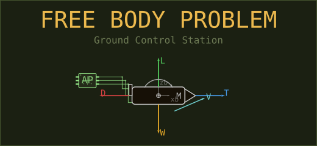
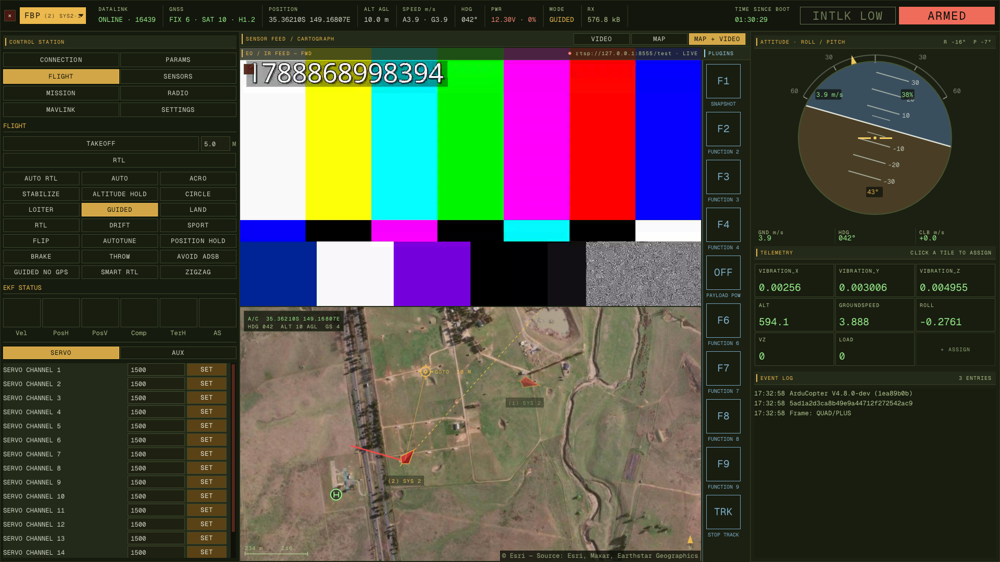
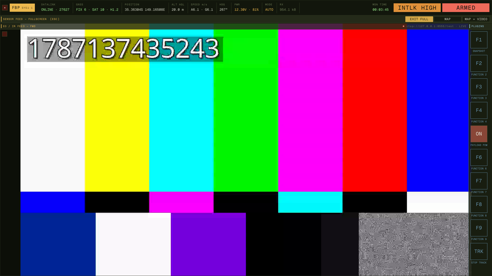

<p align="center">
  <br><br><br>
</p>


<p align="center">
  <a href="https://github.com/lazy-iframe/freebodyproblem/actions/workflows/ci.yml"></a>
  <a href="https://github.com/lazy-iframe/freebodyproblem/actions/workflows/cd.yml"></a>
  <a href="https://github.com/lazy-iframe/freebodyproblem/releases/latest"></a>
  <a href="https://github.com/lazy-iframe/freebodyproblem/releases"></a>
  <a href="https://github.com/lazy-iframe/freebodyproblem#readme"></a><br><br><br>
</p>

A modern, fast ground control station for ArduPilot and PX4 autopilots. Several links and several vehicles at once, each parsed on its own thread. Built for operators who know what they're doing. The development is in its early stages.

## Philosophy

This GCS is designed for UAV professionals and enthusiasts already familiar with MAVLink, ArduPilot/PX4 ecosystems, and autonomous systems. It prioritizes speed, responsiveness, and direct access to vehicle internals over guided workflows and safety checks. If you need a beginner-friendly interface, try something like QGroundControl which is much more user-friendly. Only the features which are actively needed during a flight will be prioritized. (firmware upload, log analysis, etc. not planned as features)

## Features

> Only tested with Ardupilot for now. PX4 support pending.



### Core Telemetry
- **Real-time vehicle state**: attitude, GPS, altitude, speed, battery, EKF health
- **MAVLink inspector**: live message stream viewer with field-level decoding for all message types
- **Parameter management**: fetch, search, edit, and write parameters with metadata tooltips
- **Parameter files**: save and load the `.params` format Mission Planner and QGroundControl use, picking per-parameter what a loaded file may change, then **WRITE ALL** to upload every staged edit in one go
- **Flight modes**: quick mode switching with visual feedback (ArduCopter/Plane/Rover/Sub)
- **EKF status**: variance bars for velocity, horizontal/vertical position, compass, terrain, and airspeed
- **Status text log**: vehicle-generated messages with severity color-coding

### Mission Planning
- **Interactive map view**: slippy map with OpenStreetMap tile support (configurable tile server)
- **Mission upload/download**: create, edit, and upload waypoints with visual feedback
- **Point-and-click waypoint editing**: click map to place waypoints during mission planning
- **Real-time vehicle tracking**: aircraft position and heading overlay on map

### Radio
- **Live channel monitor**: a bar per channel with its PWM, marked with the stick or switch it is bound to, listing only the channels the receiver is actually sending
- **Three-step calibration**: centre, sweep, review — endpoints and trim are measured from the receiver, then written as `RC*_MIN` / `MAX` / `TRIM` / `REVERSED` in one confirmed commit, with nothing sent to the vehicle until you press it
- **Stick binding with DETECT**: press DETECT beside an axis and move that stick; the channel that moves is bound
- **Flight-mode slots**: ArduPilot's six mode-switch positions, each a dropdown of the modes the vehicle itself published (AVAILABLE_MODES), beside the live bar showing which band the switch is in
- **Aux function binding**: pick a channel and the function it triggers, from the table the connected firmware implements

### Sensor Calibration
- **What the vehicle is made of**: compasses, accelerometers and gyros read out of the parameter table — chip name, bus and address, external and in-use flags — for both ArduPilot's `COMPASS_DEV_ID` / `INS_*_ID` naming and PX4's `CAL_*_ID`
- **Accelerometer**: the full six-position routine, the vehicle asking for each position in turn and the panel reporting when the airframe has been placed
- **Gyroscope**: hold still and wait; the COMMAND_ACK is the verdict
- **Compass**: ArduPilot's own `DO_START_MAG_CAL`, with progress and per-compass verdicts from `MAG_CAL_PROGRESS` / `MAG_CAL_REPORT`, and `DO_ACCEPT_MAG_CAL` to commit offsets the vehicle is holding but has not stored
- **Coverage sphere**: the 80-section geodesic grid ArduPilot tracks coverage with, drawn in body frame — lit where the compass has been turned, dim where it has not, far side visible through the near one, drag to turn. It says *which* rotations are still missing, which a percentage cannot
- **One at a time**: the three sections disable each other while any is running, since the vehicle takes one calibration at a time and a second would silently withdraw the first

### Multi-Vehicle
- **Several links at once**: CONNECT adds a link rather than replacing the one already open — a radio on serial and a SITL on UDP side by side. The **LINKS** list shows each one with its status, the number of vehicles heard on it, and a button to drop just that link
- **Several vehicles per link**: one telemetry port carrying three aircraft is three vehicles. Traffic is demultiplexed by MAVLink sysid, so a shared link or a swarm forwarded through one port no longer collapses into a single vehicle
- **A thread per vehicle**: each link reads and frames its own bytes; each vehicle then interprets them on its own thread, so a thousand-parameter fetch on one aircraft does not stall telemetry from another
- **Vehicle switcher on the callsign chip**: the topbar chip already names the system on screen, so clicking it lists the fleet — sysid, armed state, and the link each was heard on. Every tab and panel follows the selection
- **Per-vehicle panel state**: a compass calibration, a half-planned mission or a staged parameter edit belongs to the aircraft it was started on and is still there when you switch back. Nothing is carried across to a different vehicle
- **Identified by link and sysid**: two airframes that both shipped as the factory default `SYSID_THISMAV` of 1 stay distinct instead of merging into one nonsensical vehicle; the switcher names the link so they can be told apart

### Connection
- **Multiple transport layers**: UDP, TCP, Serial (Linux and Windows)
- **Auto-discovery**: serial port enumeration with device descriptions
- **Configurable baud rates**: 9600 to 921600
- **Automatic telemetry rate configuration**: requests optimal message rates on connect, addressed to each vehicle as it is discovered
- **Connection timeout handling**: 10-second connect timeout and a 15-second silence timeout, per link, with clear status indicators

### Video Streaming
- **GStreamer integration**: RTSP and UDP video streams
- **Zero-copy frame pipeline**: efficient RGB decoding for real-time display
- **Configurable stream URLs**: support for standard video sources
- **Fullscreen feed**: a second press of the video mode button (relabelled **VIDEO FULL**) hands the whole window below the topbar to the picture; ESC restores



### Auxiliary Functions
- **Servo/Aux control**: configure and trigger auxiliary functions
- **Arming/disarming**: direct vehicle control with command ACK feedback
- **Motor interlock**: safety interlock control for helicopters

### Plugins
- **User C++ functions on the rail**: a column of square buttons down the right of the centre view, each one a function you write in [`plugins/`](plugins/README.md)
- **Full vehicle access**: telemetry snapshot, the MAVLink sender, and any `MAV_CMD` via `command_long`
- **Camera surface**: start/stop the feed and save the current frame to PNG, for payload workflows the UI does not model
- **Clickable video**: click a point or drag a box on the feed to run your own handler, with coordinates in frame space — wired to payload track-point/track-rectangle out of the box
- **No build wiring**: new `.cpp` files in `plugins/` are globbed by CMake; buttons can rename themselves at runtime
- **Blue-accented rail**: the app's olive panels with blue on the seams, captions and title where the rest of the UI goes amber, so user code is never mistaken for vehicle chrome

### Audio
- **Synthesised cue tones**: PC-speaker square waves in the GRUB `GRUB_INIT_TUNE` idiom — rising on success, falling on failure, for command ACKs, mission upload and link up/down
- **Armed heartbeat**: a 440 Hz note every fifth HEARTBEAT while armed, mixed well below the alert tones — the vehicle's pulse, so silence means the link dropped
- **Progress ticks**: a blip under every progress bar, accelerating from 700 ms apart to 80 ms as the bar fills — the parking-sensor idiom, so a parameter fetch can be listened to instead of watched
- **No assets, no dependency**: tones are generated at runtime via [miniaudio](https://github.com/mackron/miniaudio) (header-only, backends loaded at runtime); a machine with no sound device logs one line and runs silent
- **Mute and volume** in the settings tab, persisted to `settings.json`

### UI/UX
- **Dear ImGui interface**: immediate-mode GUI with low latency
- **Theme support**: Tactical (default), Retro Amber and Matrix built-ins, plus customizable color schemes
- **Application log**: bottom-bar console with MAVLink events and system messages
- **Splash screen**: dismissible startup overlay


## Install

Prebuilt packages are attached to each release on the
[Releases page](https://github.com/lazy-iframe/freebodyproblem/releases).
If you only want to run the application, use these — building from source is
not required.

### Linux (Ubuntu)

**1. Refresh the package index.** The `.deb` does not vendor its runtime
libraries; apt pulls them from your configured repositories, and it can only do
that against a current index. On a fresh install this step is not optional:

```bash
sudo apt update
```

**2. Install the package.** Pass the path with a leading `./` so apt treats it
as a file rather than a package name:

```bash
sudo apt install ./freebodyproblem_0.1.0_amd64.deb
```

This reads the package's `Depends` and installs everything needed — GStreamer,
OpenSSL, GLib, OpenGL, and the C/C++ runtimes. There is no separate list of
libraries to install beforehand.

Do **not** use `dpkg -i`: it installs the package without resolving
dependencies and leaves it unconfigured. If you already did, recover with:

```bash
sudo apt --fix-broken install
```

**3. Run it.** The binary lands in `/usr/bin`, so it is already on your `PATH`:

```bash
freebodyproblem
```

Remove it later with `sudo apt remove freebodyproblem`.

#### Distribution compatibility

The dependency list is generated at build time from the machine that produced
the package, so it inherits that machine's library versions as a *minimum*.
Check what a given `.deb` actually requires before installing:

```bash
dpkg-deb --info freebodyproblem_0.1.0_amd64.deb | grep Depends
```

Two consequences worth knowing:

- **Older Ubuntu releases may refuse it.** If apt reports something like
  `libc6 (>= 2.43) but 2.39-0ubuntu8.3 is to be installed`, your release is
  older than the build machine. Build from source instead — there is no way to
  satisfy a newer glibc on an older system.
- **Debian is not covered.** The package depends on `libssl3t64` and
  `libglib2.0-0t64`, names introduced by Ubuntu's 64-bit `time_t` transition.
  Debian calls these `libssl3` and `libglib2.0-0`, so the dependencies cannot
  be satisfied there. Build from source on Debian.

#### Video streaming plugins

GStreamer loads its codecs at runtime, so they cannot be detected as hard
dependencies. They are listed under `Recommends` and apt installs them by
default. If you run apt with `--no-install-recommends`, add them yourself or
video will fail to start:

```bash
sudo apt install gstreamer1.0-plugins-{base,good,bad} gstreamer1.0-libav
```

#### Graphics driver

The UI needs an OpenGL 3.3+ core profile. Verify with `glxinfo` (from
`mesa-utils`):

```bash
glxinfo | grep "OpenGL core profile version"
```

Anything below 3.3 — common on bare VMs with no GPU passthrough — will fail at
window creation.

### Windows

**Nothing needs installing first.** The installer is self-contained: it bundles
the GStreamer runtime and its plugins, the OpenSSL libraries, and the Visual C++
runtime. Download `freebodyproblem-<version>-win64.exe` and run it.

It installs to `C:\Program Files\freebodyproblem` by default and adds a Start
Menu entry. Uninstall from **Settings → Apps**, or with the uninstaller in the
install directory.

Two things to expect:

- The installer is unsigned, so SmartScreen warns on first run. Choose
  **More info → Run anyway**.
- As on Linux, the UI needs an OpenGL 3.3+ driver. A fresh VM running on the
  Microsoft Basic Display Adapter does not provide one — install your GPU
  vendor's driver first.

---

## Building from Source

Only needed for development, or to run on a platform without a prebuilt package.

### Dependencies
- **CMake** ≥ 3.13
- **C++17 compiler** (GCC, Clang, MSVC)
- **OpenGL** 3.3+
- **GLFW** 3.4 (auto-fetched if not system-installed)
- **GStreamer** 1.0 (with gstreamer-app)
- **OpenSSL** (for HTTPS tile fetching)
- **Python 3** (build-time only, for MAVLink code generation)

### Ubuntu/Debian
```bash
sudo apt install cmake g++ libglfw3-dev libgstreamer1.0-dev \
    libgstreamer-plugins-base1.0-dev libssl-dev python3 \
    gstreamer1.0-plugins-{base,good,bad,ugly} gstreamer1.0-libav
```

### Build Steps
```bash
# Clone with submodules (includes MAVLink definitions and Dear ImGui)
git clone --recursive https://github.com/lazy-iframe/freebodyproblem.git
cd freebodyproblem

# Configure and build
cmake -B build -S . -DCMAKE_BUILD_TYPE=Release
cmake --build build --parallel

# Run
./build/freebodyproblem
```

Running straight out of the build tree works: fonts are located next to the
executable, then in the installed prefix, then in the source tree.

#### Build Options
- **MAVLINK_DIALECT**: Default `ardupilotmega`. Supports all the dialects that MAVLink main repo does.
- **MAVLINK_VERSION**: Default `2.0` (MAVLink 2.0 wire protocol)

```bash
cmake -B build -DMAVLINK_DIALECT=common -DMAVLINK_VERSION=2.0
```

### Building the Packages

Packaging is handled by CPack, which ships with CMake. The generator is selected per platform, so no `-G` argument is needed.

```bash
cmake --build build --target package
```

The result lands in `build/` — `freebodyproblem_<version>_amd64.deb` on Linux,
`freebodyproblem-<version>-win64.exe` on Windows.

Extra tooling per platform:

| Platform | Generator | Requires                                                                                         |
|----------|-----------|--------------------------------------------------------------------------------------------------|
| Linux    | `DEB`     | `dpkg-dev` (for `dpkg-shlibdeps`, which derives the dependency list)                             |
| Windows  | `NSIS`    | [NSIS](https://nsis.sourceforge.io/) (`choco install nsis`) and the GStreamer MSVC **devel** SDK |

Inspect a built `.deb` with:

```bash
dpkg-deb --info build/freebodyproblem_0.1.0_amd64.deb      # metadata and dependencies
dpkg-deb --contents build/freebodyproblem_0.1.0_amd64.deb  # file listing
```

### Releasing

Pushing a `v*` tag builds both packages and publishes them to a
[GitHub Release](https://github.com/lazy-iframe/freebodyproblem/releases)
(`.github/workflows/cd.yml`).

The version in `CMakeLists.txt` is the single source of truth — CPack stamps it
into the package filenames and metadata — so it must be bumped *before* tagging:

```bash
# 1. Bump the version
#    CMakeLists.txt:  project(freebodyproblem VERSION 0.2.0 LANGUAGES CXX)
git commit -am "release 0.2.0"
git push

# 2. Tag and push
git tag v0.2.0
git push origin v0.2.0
```

The pipeline verifies the tag against `project(... VERSION ...)` before building
anything, and fails within seconds if they disagree:

```text
Tag v0.2.0 does not match project() VERSION 0.1.0 in CMakeLists.txt.
```

To recover from that, bump the version, commit, then move the tag:

```bash
git tag -d v0.2.0
git push origin :refs/tags/v0.2.0
git tag v0.2.0 && git push origin v0.2.0
```

#### Prereleases

A hyphen in the tag marks the release as a prerelease on GitHub. The suffix is
ignored when matching against `CMakeLists.txt`, so `v0.2.0-rc1` is valid while
the project version reads `0.2.0`:

```bash
git tag v0.2.0-rc1 && git push origin v0.2.0-rc1
```

This is the safest way to exercise the release pipeline end to end without
publishing a headline version.

## Usage

### Quick Start
1. Launch `freebodyproblem`
2. Click any key to dismiss splash screen
3. Select connection type in left sidebar (Serial/TCP/UDP)
4. Configure transport parameters:
   - **Serial**: select port from dropdown, set baud rate
   - **TCP**: enter IP and port (e.g., `192.168.1.100:5760`)
   - **UDP**: bind address and port (default `0.0.0.0:14550`)
5. Click **CONNECT**
6. Telemetry will auto-configure and display within seconds

Connecting again does not replace the link you already have — it adds another.
Open as many as you need; each appears in the **LINKS** list below the connect
form with its status, how many vehicles have been heard on it, and a button to
drop that one link.

### Switching Vehicles
Every vehicle discovered on every link shows up in the switcher. Click the
**callsign chip** in the topbar — the one reading `SYS1·1` — and pick from the
list; it names each vehicle's sysid and the link it arrived on, so two aircraft
that both report sysid 1 can still be told apart. The chip only grows a caret
when there is more than one vehicle, so nothing changes when flying one.

Everything follows the selection: telemetry, parameters, mission, radio,
sensors, the inspector and the map. Panel state does not — a calibration or a
mission you were editing stays with the aircraft it belongs to and is waiting
when you switch back. Calibrations keep running on vehicles you are not looking
at, and only the selected vehicle makes sound.

### Parameter Workflow
1. Navigate to **PARAMETERS** tab
2. Click **FETCH ALL** to download full parameter set
3. Use search box to filter (e.g., `WPNAV`, `EK2_`)
4. Edit values in-place with spinners
5. Click **WRITE** to commit one change, or **WRITE ALL** to send every edited
   parameter at once (asks for confirmation, and shows the count on the button)
6. Click the **×** beside a changed value to drop that one edit, or **DISCARD**
   next to WRITE ALL to drop every staged change at once

Edits are staged until written: a row whose value differs from the vehicle's
shows an amber **WRITE**, and clears once the vehicle echoes the new value back.
Anything the vehicle misses stays visibly dirty — press again.

Only values *you* moved count as staged. A parameter the vehicle changes on its
own — ArduPilot saves its `STAT_*` counters as it runs, and broadcasts each save
— updates the row in place without ever becoming a pending edit, so WRITE ALL
can never offer to write a stale value back over a newer one.

**DISCARD** asks for confirmation because a loaded parameter file can put
hundreds of edits behind it and there is no undo. The per-row **×** does not:
it can only lose one value, and the value it restores is on the vehicle.

#### Parameter files

**SAVE** and **LOAD** under the fetch buttons read and write the `.params`
format Mission Planner and QGroundControl use, so files move between all three:

```
# Onboard parameters for Vehicle 1
#
# Stack: ArduPilot
# Vehicle: Quadrotor
# Version: 4.8.0 dev
# Git Revision: 1ea89b0b
#
# Vehicle-Id Component-Id Name Value Type
1	1	ACRO_BAL_PITCH	1.000000000000000000	9
1	1	ACRO_OPTIONS	0	2
```

The last column is `MAV_PARAM_TYPE`; floating types are written at full
precision so a saved value reloads as the same float rather than as an edit.

- **LOAD asks before it stages anything.** It opens a picker listing every
  parameter the file would change — name, the vehicle's value, and the file's —
  each with a checkbox, all ticked to start, plus **SELECT ALL** /
  **DESELECT ALL**. A config file from another airframe carries plenty that
  should not follow it over, so untick what you did not come for and **STAGE**
  the rest.
- **Only differences are offered.** Parameters the file sets to the value the
  vehicle already holds are not changes to review; they are counted in the
  picker's summary line along with parameters the vehicle does not have and
  malformed lines. If nothing differs, the picker does not open at all.
- **Staging is still not writing.** Accepted rows join the same pending edits a
  hand edit makes, so the list shows exactly what changed and **WRITE ALL**
  remains a deliberate second act.
- **SAVE writes what the list shows**, pending edits included — the file is the
  configuration in front of you, not a snapshot of the vehicle. The log says so
  whenever the two differ.

### Mission Planning
1. Navigate to **MISSION** tab in left sidebar
2. Click **REQUEST** to download current mission from vehicle
3. Click **ADD WAYPOINT** to append a new point
4. Click the **pin icon** next to a waypoint to enable map pick mode
5. Click on the map to set waypoint coordinates
6. Adjust altitude, command type (NAV_WAYPOINT, NAV_LOITER_UNLIM, etc.)
7. Click **UPLOAD** to send mission to vehicle
8. Click **CLEAR** to erase vehicle mission (zero waypoints)

### Radio Calibration
1. Fetch parameters first — **PARAMS → FETCH ALL**. Every WRITE on this tab is
   disabled until the vehicle's current values are known, and a red banner says so
2. Navigate to the **RADIO** tab and check the monitor: one row per channel the
   receiver is sending, so a radio that is off or unbound is obvious before you start
3. Click **START CALIBRATION**
4. **1 / 3 CENTRE** — centre the sticks, throttle fully down, then **CAPTURE**
5. **2 / 3 SWEEP** — move every stick and switch to both stops. The amber band on
   each bar is the travel recorded so far, and the progress reads against the
   channels actually carrying a signal, not the eighteen the protocol allows.
   **FINISH** when the count stops rising
6. **3 / 3 REVIEW** — check each channel's endpoints and trim, and tick **REV**
   where a stick runs the wrong way. A sweep cannot tell direction, so reversal
   is the one value you have to set; it is seeded from the vehicle so an
   already-correct radio is not un-reversed
7. **COMMIT** writes the lot after a confirmation naming the parameter count.
   **DISCARD** leaves the vehicle untouched

The calibration keeps recording while you look at another tab, or at another
aircraft — it is the vehicle and the radio doing the work, not the panel.

Below the calibration: **BINDING** binds each axis to a channel (press
**DETECT**, move that stick), sets ArduPilot's six flight-mode slots from the
mode list the vehicle published, and binds an aux function to a channel. Each
row writes on its own.

### Sensor Calibration
1. Fetch parameters first, as above — the device lists are read from them
2. Navigate to the **SENSORS** tab. Each section lists what the vehicle actually
   has: chip name, bus and address, and whether a compass is external and in use
3. **Disarm before calibrating.** Every button here is disabled while armed
4. **Accelerometer** — press **CALIBRATE ACCELEROMETER**, then place the airframe
   as the vehicle asks (level, on each side, nose down, nose up, on its back) and press
   the button for each position. The vehicle drives the sequence; the panel
   reports when the airframe is in place
5. **Gyroscope** — press **CALIBRATE GYROSCOPE** and leave the vehicle still.
   It answers with a single ACK, which is the result
6. **Magnetometer** — press **CALIBRATE MAGNETOMETER** and rotate the vehicle
   slowly through every orientation, keeping clear of metal, magnets and wiring.
   The sphere fills in as directions are covered: turn the airframe so the dim
   patches come round. On ArduPilot the run ends with a per-compass verdict and
   a worst-fit figure in milligauss; press **ACCEPT CALIBRATION** if the vehicle
   is holding the offsets rather than storing them
7. Reboot when it is done — new offsets take effect at boot, and there is a
   **REBOOT VEHICLE** button on the panel

Only one calibration runs at a time *per vehicle*: starting a second would
silently withdraw the first, so each section greys out the others while it is
busy. A run survives a tab switch and a vehicle switch — it belongs to the
aircraft it was started on and keeps advancing while you look elsewhere — and is
abandoned with a log line if the link drops.

### MAVLink Inspector
1. Navigate to **MAVLINK** tab
2. View message ID, name, and receive rate in scrollable table
3. Click a message row to decode all fields in the detail panel below
4. Use the **REQUEST** panel to configure message intervals (MAVLink 2 only):
   - Enter message ID (e.g., `33` for GLOBAL_POSITION_INT)
   - Set rate in Hz (e.g., `10`)
   - Click **SEND** to apply

### Video Streaming
1. Navigate to the **VIDEO** area
2. Enter stream URL:
   - RTSP: `rtsp://192.168.1.100:8554/stream`
   - UDP: `udp://0.0.0.0:5600`
3. Click **START STREAM**
4. Video will render in center view
5. With the feed alone in the centre view the button relabels itself
   **VIDEO FULL** — press it and the feed goes fullscreen: both sidebars give
   way and the picture takes the whole window below the topbar, so link state,
   arming and the annunciators are never hidden. The plugin rail stays,
   floating over the feed's right edge, since there are no sidebars left to
   take its width from. The button then reads **EXIT FULL**; that, **ESC**, or
   either other mode button brings the panels back.

### Audio Cues
1. Navigate to **SETTINGS** tab, **AUDIO** section
2. **Tones** mutes everything; the volume slider is linear, and **TEST** plays
   the success tone
3. Both settings save immediately and survive a restart

What plays, and when:

Square waves at 125 ms a note, written in the idiom of GRUB's `GRUB_INIT_TUNE`
(tempo 480, so one beat is 125 ms):

| Cue | Sound | As a GRUB tune | Fires on |
|---|---|---|---|
| Success | rising fifth | `480 440 1 660 1` | a hand-issued command the vehicle accepted (arm/disarm, takeoff, RTL, mode change, aux function), mission upload accepted, link established |
| Failure | three notes falling | `480 660 1 440 1 330 1` | the same commands rejected, mission upload failed, link error or timeout |
| Armed | one note, every 5th HEARTBEAT | `480 440 1` | the whole time the vehicle is armed — starting on the arming heartbeat itself |
| Progress | short blip, accelerating | `480 880 0.25` | under a progress bar — parameter fetch, mission download |

Telemetry-rate and capability requests are ACKed too, but deliberately make no
sound: a burst of beeps at every connect trains you to ignore the cue.

The progress tick is the parking-sensor idiom: the gap between blips shrinks
from 700 ms at 0% to 80 ms at 100%, so **how far along** and **still moving**
are both in the ear and a long parameter fetch can be started and then watched
out of the window. The gap shrinks geometrically rather than linearly — each
10% of the bar speeds the ticking up by the same proportion, because tempo is
heard as a ratio, and a straight line in milliseconds sounds like nothing
happens until the very end. The tempo follows the fraction and not its rate of
change, so a transfer that stalls at 60% keeps ticking steadily at its 60%
tempo: an unchanging tempo is audibly a stall, where silence would be
indistinguishable from a transfer that quietly finished. Transfers tick on
independent channels, so a mission download during a parameter fetch keeps its
own tempo instead of the two beating against each other.

The armed beep counts HEARTBEATs rather than seconds — every fifth one, so
about every five seconds at the 1 Hz ArduPilot sends them. Counting the
vehicle's pulse rather than a clock carries what a clock cannot: **beeping that
stops while the aircraft is still armed means the link went, not that the
vehicle disarmed.**

### Themes
1. Navigate to **SETTINGS** tab
2. Select **Tactical** (default), **Retro Amber** or **Matrix**
3. Create custom themes by editing color values
4. Themes persist across sessions via `settings.json`

## Architecture

The process runs one thread per link and one thread per vehicle. A link reads
bytes and frames them; framing has to happen there because a message's sysid is
not knowable until it is framed. Everything after that — the message dispatch,
the parameter table, the mission state and the protocol timers — belongs to one
vehicle and runs on that vehicle's own thread. Sending goes the other way: a
vehicle queues frames in its own sender, and the link, which owns the socket or
the serial handle, drains them.

```
  socket / serial ──▶ link thread          one per connection
                       read, frame, demux on sysid
                              │
                              ▼  inbox
                     vehicle thread        one per vehicle
                       dispatch, protocol timers, snapshot
                              │
                              ▼  snapshot
                        UI thread          draws the selected vehicle
```

### Backend (`backend/`)
- **connection.cpp**: Serial port enumeration (Linux/Windows)
- **link.cpp**: One transport — UDP socket, TCP connection or serial port — and the platform detail behind opening, reading and writing it
- **fleet.cpp**: Every link and vehicle, the link read threads, and the sysid demultiplexing that decides which vehicle a message belongs to
- **vehicle.cpp**: One vehicle and the thread that talks to it — stream rates, the mode list, clock sync, the parameter fetch and its retransmits, and the snapshot the UI reads
- **mavlink_framer.hpp**: Byte stream to whole messages, with the reassembly buffer held per link rather than in the library's per-channel globals, so links can frame concurrently
- **mavlink_parser.cpp**: MAVLink message decoder with per-ID stats tracking; one per vehicle, and it accepts only that vehicle's system
- **mavlink_sender.cpp**: Command queue with ACK tracking and retransmit logic; one per vehicle, each on its own MAVLink TX channel so their sequence counters stay independent
- **rc_calibration.cpp** / **rc_binding.cpp**: RC endpoint measurement and the stick/mode/aux parameter tables, per stack
- **accel_calibration.cpp** / **gyro_calibration.cpp** / **mag_calibration.cpp**: the GCS half of each calibration — link-free state machines fed messages and a clock
- **sensor_inventory.cpp**: compass/accel/gyro devices decoded out of the parameter table (device-ID packing, chip names)
- **geodesic_grid.cpp**: ArduPilot's 80-section coverage grid, for drawing what a compass calibration has and has not seen

### Frontend (`frontend/`)
- **main.cpp**: GLFW/OpenGL event loop, the app log, and the per-frame snapshot of whichever vehicle is selected
- **settings.cpp**: JSON-based persistent configuration (tile server, themes, window state)
- **param_file.cpp**: `.params` reader/writer (Mission Planner / QGroundControl format)
- **audio.cpp**: synthesised cue tones and accelerating progress ticks — lock-free voice pool mixed on the miniaudio callback
- **widgets/**: Modular UI components (topbar, sidebars, map, video, telemetry panels)
  - **vehicle_ui_state.hpp**: Panel state that belongs to a vehicle rather than a panel — a calibration in progress, staged parameter edits, the mission being planned — keyed by vehicle instead of held in a file-scope static, and dropped when that vehicle goes
  - **sidebar_left/**: Tab-based left panel (connection, flight, params, themes, mission, MAVLink, radio, sensors)
  - **map_view.cpp**: Multi-threaded tile fetcher with OpenGL texture upload
  - **video_player.cpp**: GStreamer pipeline wrapper with RGB frame extraction
  - **plugin_rail.cpp**: Button column driving the user plugins in `plugins/`
  - **mavlink_display_generated.cpp**: Auto-generated message field decoders (from MAVLink XML)

### Plugins (`plugins/`)
- **plugin_api.hpp**: What a plugin sees and how it registers — buttons, startup hooks, video-gesture handlers
- **plugin_registry.cpp**: Registration lists, startup pass, and dispatch
- **user_plugins.cpp**: Example slots, yours to edit — see [plugins/README.md](plugins/README.md)

### Code Generation
- **scripts/gen_mavlink_display.py**: Parses MAVLink XML definitions to generate C++ field decoders for all message types

### Libraries
- **Dear ImGui** (third_party/imgui): Immediate-mode GUI
- **MAVLink** (third_party/mavlink): Auto-generated C headers (ardupilotmega dialect)
- **stb_image / stb_image_write** (FetchContent): PNG/JPG decoding for map tiles, PNG encoding for video snapshots
- **miniaudio** (FetchContent): header-only audio playback for the cue tones
- **cpp-httplib** (FetchContent): HTTPS client for tile server requests
- **nlohmann/json** (FetchContent): JSON parsing for settings and firmware manifests

## Project Structure
```
freebodyproblem/
├── backend/              # Links, vehicles, MAVLink parsing, command queue
├── frontend/             # ImGui UI, widgets, rendering
│   └── widgets/          # Reusable UI components
│       └── sidebar_left/ # Per-tab left sidebar modules
├── plugins/              # User C++ functions bound to the button rail
├── scripts/              # Python code generators
├── third_party/          # Git submodules (imgui, mavlink)
└── CMakeLists.txt        # Build configuration
```

## Configuration

Settings are auto-saved to a per-user location, not the working directory:

| Platform | Path                                                                                           |
|----------|------------------------------------------------------------------------------------------------|
| Linux    | `$XDG_CONFIG_HOME/freebodyproblem/settings.json`, or `~/.config/freebodyproblem/settings.json` |
| Windows  | `%APPDATA%\freebodyproblem\settings.json`                                                      |

If neither environment variable is set, it falls back to
`./freebodyproblem_settings.json` in the working directory.

Map tiles are cached separately, under
`$XDG_CACHE_HOME`/`~/.cache/freebodyproblem/tiles` on Linux and
`%LOCALAPPDATA%\freebodyproblem\tiles` on Windows. Deleting that directory is
safe — tiles are refetched on demand.

Settings contents:
- **Active theme**: Selected color scheme
- **Custom themes**: User-defined color palettes
- **Tile server**: URL template and attribution string
- **Video URL**: Last used stream source

Example `settings.json`:
```json
{
  "active_theme": "Tactical",
  "tile_url": "https://tile.openstreetmap.org/{z}/{x}/{y}.png",
  "tile_attribution": "© OpenStreetMap contributors",
  "video_url": "udp://0.0.0.0:5600",
  "themes": {
    "Custom": {
      "bg": [0.05, 0.05, 0.08],
      "accent": [0.2, 0.8, 0.9],
      ...
    }
  }
}
```

## Performance Notes

- **Parallel per-vehicle work**: framing is cheap and stays on the link thread; the message dispatch, parameter table, mission state and protocol timers run per vehicle and overlap, so a slow conversation with one aircraft does not hold up another
- **One message copy at the hand-off**: a framed message is copied once into the owning vehicle's inbox. The inbox is bounded, and a vehicle that falls far enough behind to drop from it says so in the log rather than losing telemetry silently
- **Rate-capped snapshots**: each vehicle publishes its state at ~20 Hz rather than on every datagram, and the UI copies only the vehicle on screen
- **Threaded tile fetching**: Map tiles load asynchronously without blocking the render loop
- **Exponential moving average rates**: Message rate display decays gracefully when telemetry stops
- **Parameter retransmit logic**: Automatically re-requests dropped PARAM_VALUE packets after 2s stall

## Limitations

- **No firmware upload**: Use ArduPilot's `uploader.py` or Mission Planner for bootloader operations
- **No log download**: Access DataFlash logs via MAVLink file transfer in other tools
- **OS support**: Linux and Windows are built and packaged by CI. macOS is not currently built or tested.
- **No telemetry replay**: Live connections only; no `.tlog` or `.bin` file playback
- **No geofence editor**: Geofence/rally point management not implemented yet
- **One vehicle on screen at a time**: the backend carries the whole fleet, but the panels and the map draw the selected vehicle only — no side-by-side view, and no other aircraft shown on the map yet
- **One vehicle per link per sysid**: an aircraft reachable over two links at once appears as two entries rather than being recognised as one. Merging them wants a real identity to key on (the board UID) and is not done yet
- **Fifteen vehicles**: each needs a MAVLink TX channel of its own so their sequence counters stay independent, and one of the sixteen is spent on the fallback used when nothing is connected. Past the cap a vehicle is logged and ignored rather than displacing one already there

## Future Plans

- Implementations of "Console" and "ESC" tabs, for the MAVLink console and for ESC configuration with motor test.
- Multi-vehicle UI: every aircraft on the map at once, and a way to watch more than one without switching
- PX4 Support
- macOS Support
- Video AI features

## Contributing

This is a personal project built for speed and clarity over feature completeness (only the features needed **during** the flight should be implemented). PRs welcome for:
- Bug fixes
- Performance improvements
- Additional MAVLink message handlers
- macOS support
- Telemetry graph overlays
- Other features which are essential during a flight

Please keep contributions focused on the core philosophy: fast, direct, minimal abstraction.
