<p align="center">
  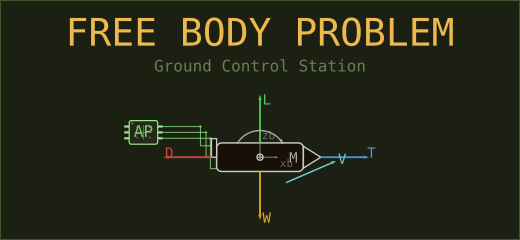<br><br><br>
</p>


<p align="center">
  <a href="https://github.com/lazy-iframe/freebodyproblem/actions/workflows/ci.yml"></a>
  <a href="https://github.com/lazy-iframe/freebodyproblem/actions/workflows/cd.yml"></a>
  <a href="https://github.com/lazy-iframe/freebodyproblem/releases/latest"></a>
  <a href="https://github.com/lazy-iframe/freebodyproblem/releases"></a>
  <a href="https://github.com/lazy-iframe/freebodyproblem#readme"></a>
</p>

<p align="center">
  <a href="#features"><b>Features</b></a> &nbsp;·&nbsp;
  <a href="#install"><b>Install</b></a> &nbsp;·&nbsp;
  <a href="#building-from-source"><b>Build</b></a> &nbsp;·&nbsp;
  <a href="#usage"><b>Usage</b></a> &nbsp;·&nbsp;
  <a href="#ai-agents-mcp-1"><b>AI Agents</b></a> &nbsp;·&nbsp;
  <a href="#architecture"><b>Architecture</b></a> &nbsp;·&nbsp;
  <a href="plugins/README.md"><b>Plugins</b></a><br><br>
</p>

A modern, fast ground control station for ArduPilot and PX4 autopilots. Several links and several vehicles at once, each parsed on its own thread. Built for operators who know what they're doing.

> [!WARNING]
> **This GCS is still in early development.** Expect missing features, rough edges and changes between releases. Try it in SITL or on the bench before you trust it with an aircraft in flight.

<p align="center">
  <a href="screens/cap0.png">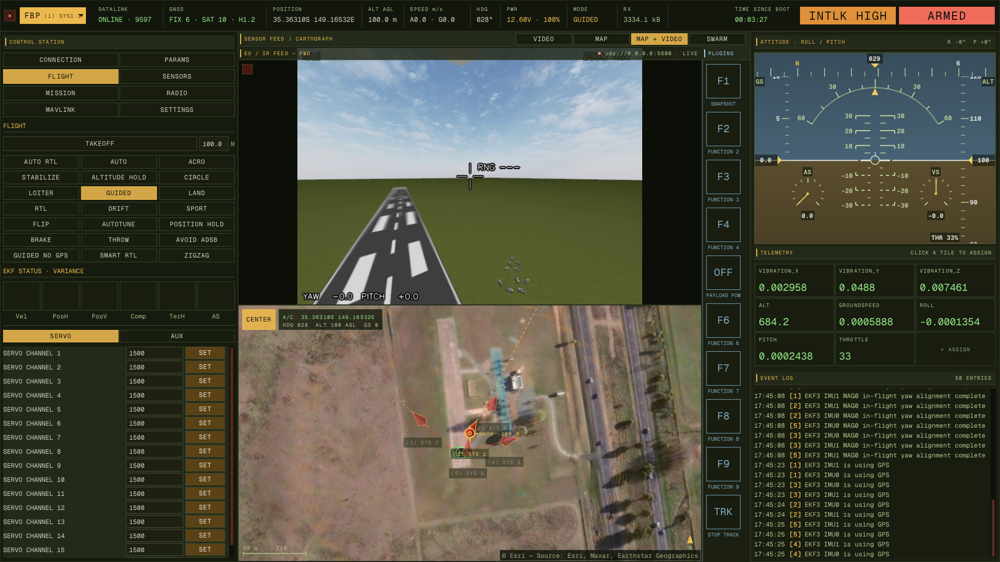</a>
</p>

<table>
  <tr>
    <td align="center" width="50%">
      <a href="#the-map"></a><br>
      <sub><b>MAP</b> — the map alone in the centre, both sidebars in place</sub>
    </td>
    <td align="center" width="50%">
      <a href="#video-streaming-1">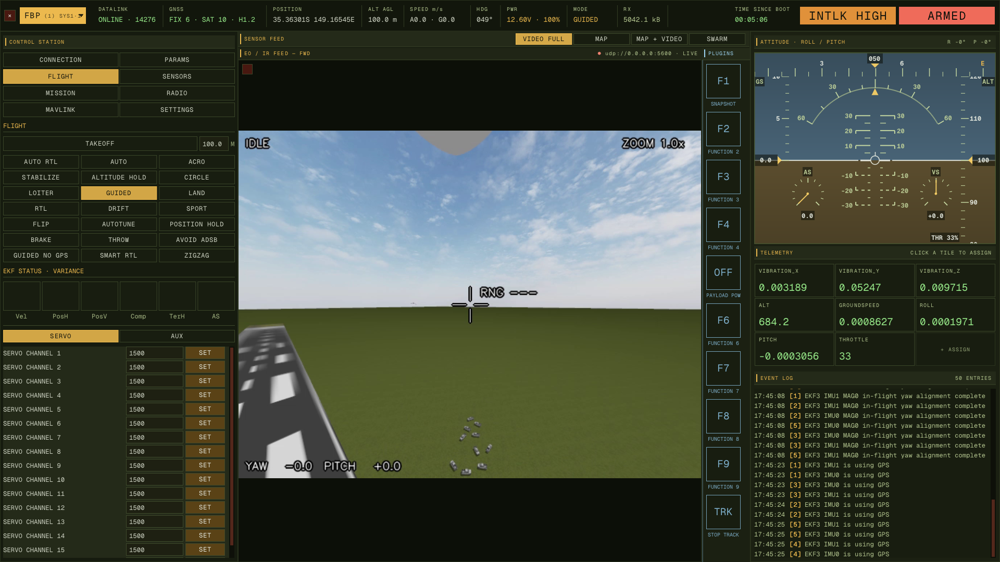</a><br>
      <sub><b>VIDEO</b> — the feed alone in the centre, both sidebars in place</sub>
    </td>
  </tr>
  <tr>
    <td align="center" width="50%">
      <a href="#the-map"></a><br>
      <sub><b>MAP FULL</b> — the map takes the right sidebar; attitude and the event log float in its corner</sub>
    </td>
    <td align="center" width="50%">
      <a href="#video-streaming-1">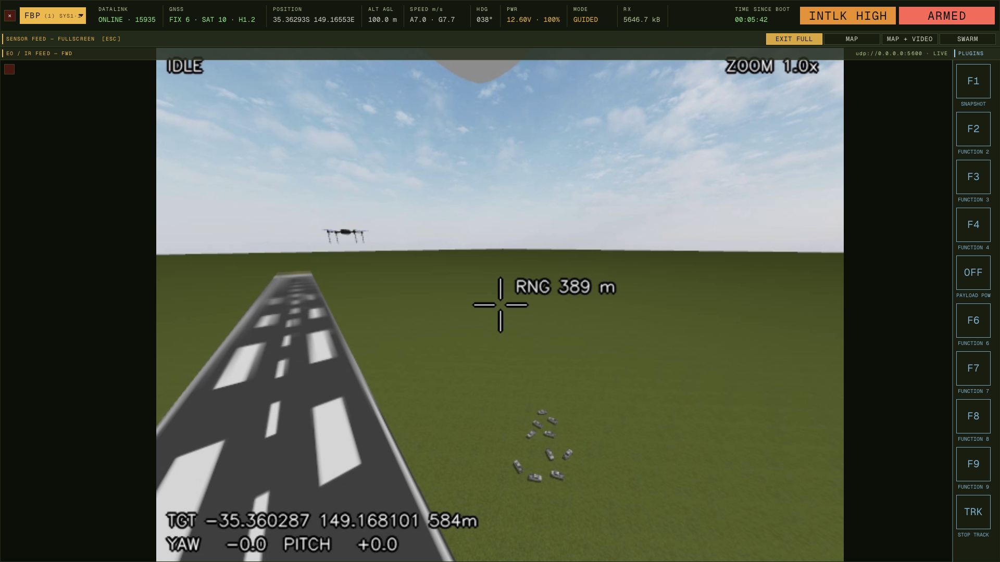</a><br>
      <sub><b>VIDEO FULL</b> — the feed takes the whole window below the topbar</sub>
    </td>
  </tr>
</table>

<table>
  <tr>
    <td align="center" width="28%">
      <a href="#screen-sizes">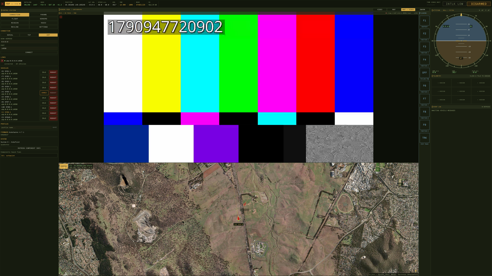</a><br>
      <sub><b>4K</b> — stacked; the sidebars stop growing and the centre gets the rest</sub>
    </td>
    <td align="center" width="28%">
      <a href="#screen-sizes">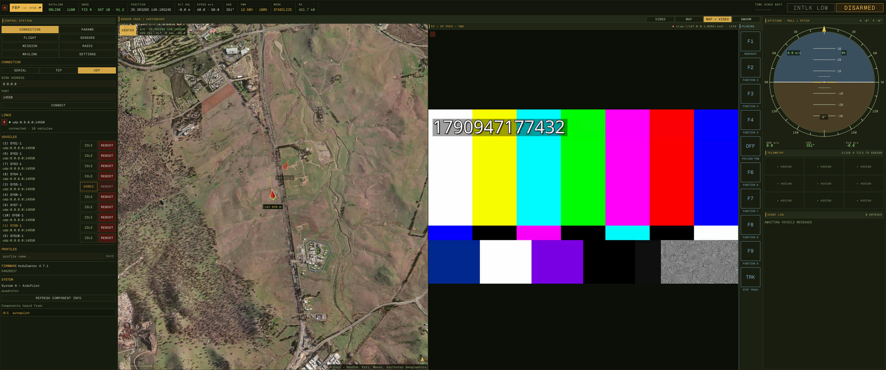</a><br>
      <sub><b>3440×1440</b> — side by side: map | video, halves</sub>
    </td>
    <td align="center" width="28%">
      <a href="#screen-sizes">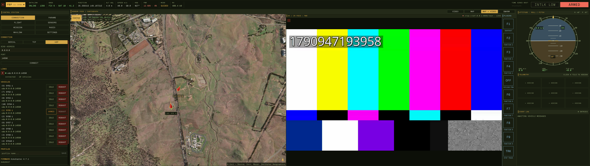</a><br>
      <sub><b>3840×1080</b> — side by side on 32:9</sub>
    </td>
    <td align="center" width="16%">
      <a href="#screen-sizes">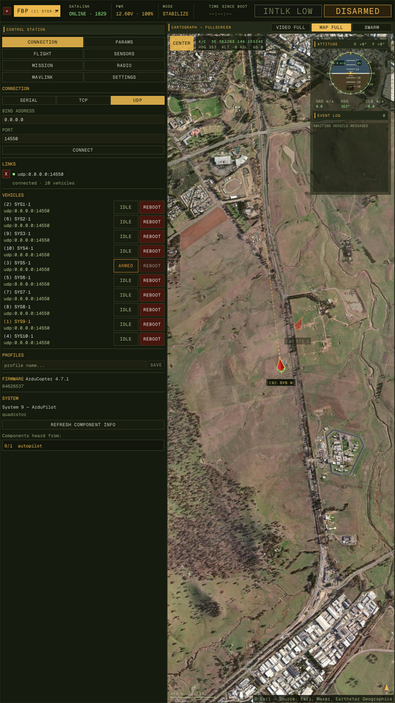</a><br>
      <sub><b>1080×1920</b> — narrow: fullscreen only</sub>
    </td>
  </tr>
</table>

<table>
  <tr>
    <td align="center" width="20%">
      <a href="#flight-controls">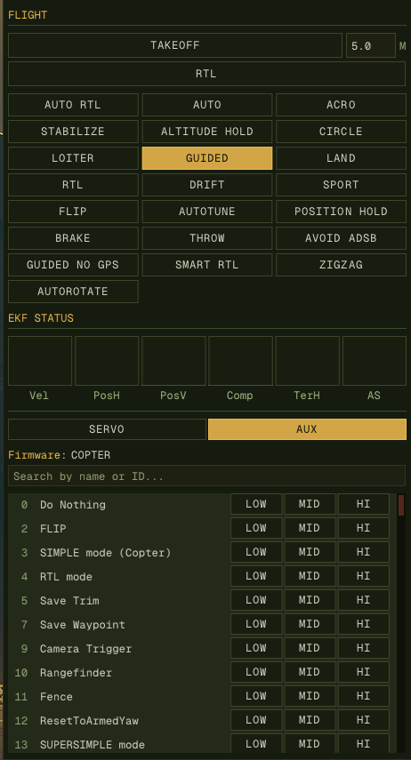</a><br>
      <sub><b>FLIGHT</b></sub>
    </td>
    <td align="center" width="20%">
      <a href="#parameter-workflow"></a><br>
      <sub><b>PARAMS</b></sub>
    </td>
    <td align="center" width="20%">
      <a href="#radio-calibration">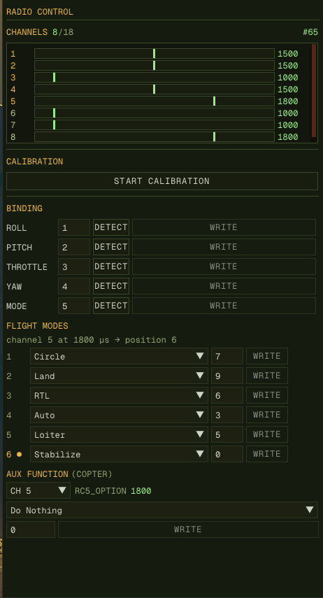</a><br>
      <sub><b>RADIO</b></sub>
    </td>
    <td align="center" width="20%">
      <a href="#sensor-calibration-1">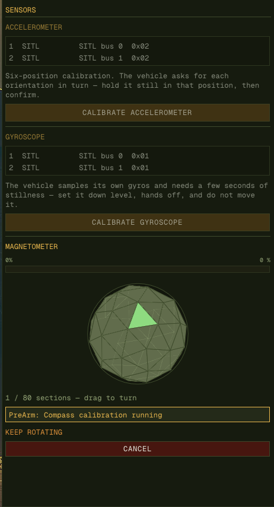</a><br>
      <sub><b>SENSORS</b></sub>
    </td>
    <td align="center" width="20%">
      <a href="#mavlink-inspector">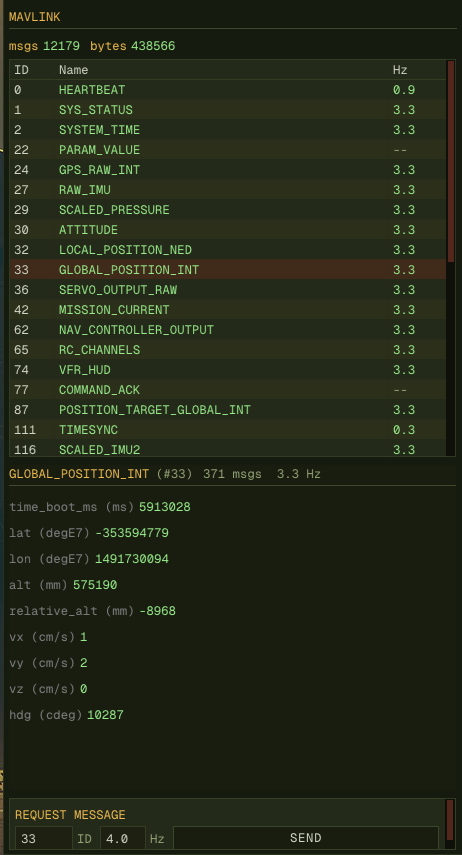</a><br>
      <sub><b>MAVLINK</b></sub>
    </td>
  </tr>
</table>

<p align="center"><sub>Click a screenshot to jump to how that part of the app is used.</sub></p>

## Philosophy

This GCS is designed for UAV professionals and enthusiasts already familiar with MAVLink, ArduPilot/PX4 ecosystems, and autonomous systems. It prioritizes speed, responsiveness, and direct access to vehicle internals over guided workflows and safety checks. If you need a beginner-friendly interface, try something like QGroundControl which is much more user-friendly. Only the features which are actively needed during a flight will be prioritized. (firmware upload, log analysis, etc. not planned as features)

## Features

> ArduPilot is the primary target. PX4 works for **telemetry and flight modes** —
> heartbeat, attitude, position, battery, GPS, estimator health, arming and mode
> switching, verified against PX4 SITL. Mission, parameters, RC configuration and
> sensor calibration remain ArduPilot-shaped; where a panel cannot work on PX4 it
> says so rather than failing quietly.

### Core Telemetry
- **Real-time vehicle state**: attitude, GPS, altitude, speed, battery, EKF health
- **HUD**: a full-panel flight display — horizon edge to edge, a ±60° roll arc, and moving tapes for ground speed (left), heading (top) and altitude (right) — or the classic attitude ball, chosen separately for the main view and the swarm cards in the settings tab
- **MAVLink inspector**: live message stream viewer with field-level decoding for all message types
- **Parameter management**: fetch, search, edit, and write parameters, each with its ArduPilot Copter, ArduPilot Plane or PX4 documentation one click away and an editor that fits its type — dropdowns for enums, hex and checkboxes for bitmasks
- **Parameter files**: save and load the `.params` format Mission Planner and QGroundControl use, picking per-parameter what a loaded file may change, then **WRITE ALL** to upload every staged edit in one go
- **Flight modes**: quick mode switching with visual feedback (ArduCopter/Plane/Rover/Sub)
- **EKF status**: variance bars for velocity, horizontal/vertical position, compass, terrain, and airspeed
- **Status text log**: vehicle-generated messages with severity color-coding

### Mission Planning
- **Interactive map view**: slippy map with OpenStreetMap tile support (configurable tile server)
- **Mission upload/download**: create, edit, and upload waypoints with visual feedback
- **Point-and-click mission building**: a grid of mission commands (WAYPOINT, TAKEOFF, LAND, RTL, LOITER, ...) — press one, its button reads **LOC?**, click the map and the item is added there; commands with no position are added straight away
- **Drag to edit**: with **EDIT** on, drag any waypoint on the map to move it
- **Geofence**: both kinds ArduPilot and PX4 offer. The parameter-set fence — `FENCE_RADIUS` and `FENCE_ALT_MAX` (PX4: `GF_MAX_HOR_DIST`, `GF_MAX_VER_DIST`) — is read on connect and drawn as an amber ring around home, labelled with its radius and ceiling, dashed and marked OFF when the fence is not enabled. Uploaded fences are drawn and edited in the mission tab's **GEOFENCE** view: inclusion zones in green and exclusion zones in red, each a polygon or a circle drawn straight on the map, sent as the vehicle's fence list (`MAV_MISSION_TYPE_FENCE`)
- **GO HERE**: right-click anywhere on the map for a guided position target — the altitude defaults to the height the vehicle is already holding, and the point goes out as `SET_POSITION_TARGET_GLOBAL_INT`. Offered only while the vehicle is in GUIDED, since that is the only mode that acts on one; the target stays drawn on the map, tied to the aircraft by a line, until it is cleared
- **Real-time vehicle tracking**: aircraft position and heading overlay on map, the heading line run out to the edge of the panel. The map follows the selected aircraft until you drag it; **CENTER**, top-left, puts it back on the aircraft and following again
- **The whole fleet on one map**: every connected vehicle is drawn, not just the one the panels are bound to, each labelled `(2) SYS 1` — the number is the GCS's own, handed out lowest-free-first on discovery, because a sysid is not a name and two airframes off the bench both answer to 1. The active aircraft keeps full colour and its edge-to-edge heading line; the rest are dimmed with a short heading stub
- **Fullscreen map**: a second press of the map mode button (relabelled **MAP FULL**) gives the map the right sidebar's width and the plugin rail's column, keeping the left sidebar — the tabs are how a mission is planned and the map is what it is planned on. Attitude and the event log come back as a semi-transparent block in the map's top-right corner, small enough to read past — click either half and it grows back to the size it had in the sidebar, text and all, until you click somewhere else, and it comes back small every time the map goes fullscreen again; **ESC** or **EXIT FULL** restores
- **Home**: each vehicle's `HOME_POSITION` drawn as a helipad — the H inside its circle, in green so it reads as neither the aircraft nor an instruction to it. Streamed at 0.5 Hz on connect rather than waited for: a vehicle announces home when it sets it, and that announcement is long gone by the time a GCS joins
- **Position trail**: where each aircraft has been, thinned to a point every 3 m so a vehicle standing still does not smudge, and recorded per vehicle off the live stream — an aircraft that flew while you were watching another one still has its track when you switch back. Cleared from the map's right-click menu

### Radio
- **Live channel monitor**: a bar per channel with its PWM, marked with the stick or switch it is bound to, listing only the channels the receiver is actually sending
- **Three-step calibration**: centre, sweep, review — endpoints and trim are measured from the receiver, then written as `RC*_MIN` / `MAX` / `TRIM` / `REVERSED` in one confirmed commit, with nothing sent to the vehicle until you press it
- **Stick binding with DETECT**: press DETECT beside an axis and move that stick; the channel that moves is bound
- **Flight-mode slots**: ArduPilot's six mode-switch positions, each a dropdown of the modes the vehicle itself published (AVAILABLE_MODES), beside the live bar showing which band the switch is in
- **Aux function binding**: pick a channel and the function it triggers, from the table the connected firmware implements

### Sensor Calibration
- **What the vehicle is made of**: compasses, accelerometers and gyros read out of the parameter table — chip name, bus and address, external and in-use flags — for both ArduPilot's `COMPASS_DEV_ID` / `INS_*_ID` naming and PX4's `CAL_*_ID`
- **Accelerometer**: the full six-position routine, the vehicle asking for each position in turn and the panel reporting when the airframe has been placed
- **Gyroscope**: hold still and wait; the COMMAND_ACK is the verdict
- **Compass**: ArduPilot's own `DO_START_MAG_CAL`, with progress and per-compass verdicts from `MAG_CAL_PROGRESS` / `MAG_CAL_REPORT`, and `DO_ACCEPT_MAG_CAL` to commit offsets the vehicle is holding but has not stored
- **Coverage sphere**: the 80-section geodesic grid ArduPilot tracks coverage with, drawn in body frame — lit where the compass has been turned, dim where it has not, far side visible through the near one, drag to turn. It says *which* rotations are still missing, which a percentage cannot
- **One at a time**: the three sections disable each other while any is running, since the vehicle takes one calibration at a time and a second would silently withdraw the first

### Multi-Vehicle
- **Several links at once**: CONNECT adds a link rather than replacing the one already open — a radio on serial and a SITL on UDP side by side. The **LINKS** list shows each one with its status, the number of vehicles heard on it, and a button to drop just that link
- **Several vehicles per link**: one telemetry port carrying three aircraft is three vehicles. Traffic is demultiplexed by MAVLink sysid, so a shared link or a swarm forwarded through one port no longer collapses into a single vehicle
- **No cap on fleet size**: each vehicle numbers its own outgoing MAVLink frames, so nothing in the GCS limits how many it holds. The ceiling is MAVLink's 254 system IDs per link, and in practice the machine's CPU — fifty SITL copters on one link run without trouble
- **A thread per vehicle**: each link reads and frames its own bytes; each vehicle then interprets them on its own thread, so a thousand-parameter fetch on one aircraft does not stall telemetry from another
- **Vehicle switcher on the callsign chip**: the topbar chip already names the system on screen, so clicking it lists the fleet — sysid, armed state, and the link each was heard on. Every tab and panel follows the selection
- **Per-vehicle panel state**: a compass calibration, a half-planned mission or a staged parameter edit belongs to the aircraft it was started on and is still there when you switch back. Nothing is carried across to a different vehicle
- **Identified by link and sysid**: two airframes that both shipped as the factory default `SYSID_THISMAV` of 1 stay distinct instead of merging into one nonsensical vehicle; the switcher names the link so they can be told apart
- **A number per vehicle**: the GCS hands each aircraft a short number on discovery, lowest free one first, and that number leads the callsign chip, the switcher rows and the label on every symbol on the map. It is the name a sysid cannot be, and it stays small — numbers are freed when a vehicle goes, so a fleet of three reads 1, 2, 3 rather than climbing all session
- **The fleet on the map**: every vehicle with a position is drawn, each with its own trail and home pad. The panels still follow one aircraft, and the map says which by keeping it at full strength while the others are dimmed
- **SWARM view**: a card per vehicle with its attitude, mode, battery, GPS and EKF health, and the one place commands go to several vehicles at once — check the ones you want, then switch modes, take off, arm or set the interlock across all of them. See [Swarm View](#swarm-view)

### Connection
- **Multiple transport layers**: UDP, TCP, Serial (Linux and Windows)
- **Auto-discovery**: serial port enumeration with device descriptions
- **Configurable baud rates**: 9600 to 921600
- **Automatic telemetry rate configuration**: requests optimal message rates on connect, addressed to each vehicle as it is discovered
- **The GCS announces itself**: a `HEARTBEAT` per link per second, as MAV_TYPE_GCS. Vehicles count the time since they last heard from a ground station, and PX4 will not arm without one — its prearm check reads *no connection to GCS*. ArduPilot leaves the equivalent failsafe off by default, which is why this was easy to miss
- **Connection timeout handling**: 10-second connect timeout and a 15-second silence timeout, per link, with clear status indicators

### Video Streaming
- **GStreamer integration**: RTSP and UDP video streams
- **Zero-copy frame pipeline**: efficient RGB decoding for real-time display
- **Configurable stream URLs**: support for standard video sources
- **Fullscreen feed**: a second press of the video mode button (relabelled **VIDEO FULL**) hands the whole window below the topbar to the picture; ESC restores

### Auxiliary Functions
- **Servo/Aux control**: configure and trigger auxiliary functions
- **Arming/disarming**: direct vehicle control with command ACK feedback
- **Motor interlock**: safety interlock control for helicopters

### Plugins
- **User C++ functions on the rail**: a column of square buttons down the right of the centre view, each one a function you write in [`plugins/`](plugins/README.md)
- **Full vehicle access**: telemetry snapshot, the MAVLink sender, and any `MAV_CMD` via `command_long`
- **Camera surface**: start/stop the feed and save the current frame to PNG, for payload workflows the UI does not model
- **Clickable video**: click a point or drag a box on the feed to run your own handler, with coordinates in frame space — wired to payload track-point/track-rectangle out of the box
- **No build wiring**: new `.cpp` files in `plugins/` are globbed by CMake; buttons can rename themselves at runtime
- **Blue-accented rail**: the app's olive panels with blue on the seams, captions and title where the rest of the UI goes amber, so user code is never mistaken for vehicle chrome

### AI Agents (MCP)
- **Built-in MCP server**: any agent or LLM host that speaks the [Model Context Protocol](https://modelcontextprotocol.io) — Claude Code, opencode, Claude Desktop, or a small model running locally — can read the fleet: telemetry, parameters, missions and status messages. Loopback only, behind a token, and off until you switch it on
- **Actions you control**: arm, disarm, takeoff, goto, mode changes, mission upload/start/pause, RTL, parameter writes and plugin buttons — off until **Allow actions** is ticked, and each one either waits for you to click **ALLOW** in an on-screen dialog or runs straight away, as you choose per action
- **Made for small models too**: `goto` takes "100 m north" as `north_m: 100` and the GCS does the coordinate arithmetic; every tool and argument is described in plain language
- **Your rules for agents**: a free-text box of site rules, sent to every agent when it connects
- **Several agents, one fleet**: agents can claim vehicles so others cannot command them, and a takeoff or goto whose path comes within 10 m of another vehicle, or of another agent's target, is flagged in the approval dialog
- **Everything logged**: every agent action and its outcome in the event log, tagged **MCP**
- **`freebodyproblem-mcp`**: a small stdio adapter installed beside the GCS, for hosts that launch servers as programs; **COPY ADAPTER PATH** in settings gives its exact location. See [AI Agents (MCP)](#ai-agents-mcp-1)

### Audio
- **Synthesised cue tones**: PC-speaker square waves in the GRUB `GRUB_INIT_TUNE` idiom — rising on success, falling on failure, for command ACKs, mission upload and link up/down
- **Armed heartbeat**: a 440 Hz note every fifth HEARTBEAT while armed, mixed well below the alert tones — the vehicle's pulse, so silence means the link dropped
- **Progress ticks**: a blip under every progress bar, accelerating from 700 ms apart to 80 ms as the bar fills — the parking-sensor idiom, so a parameter fetch can be listened to instead of watched
- **No assets, no dependency**: tones are generated at runtime via [miniaudio](https://github.com/mackron/miniaudio) (header-only, backends loaded at runtime); a machine with no sound device logs one line and runs silent
- **Mute and volume** in the settings tab, persisted to `settings.json`

### UI/UX
- **Dear ImGui interface**: immediate-mode GUI with low latency
- **Fits the screen it is on**: sidebars sized by their text rather than by a fraction of the window, the video and map stacked or side by side by the shape of the space left, and a narrow layout for laptops and portrait screens — see [Screen Sizes](#screen-sizes)
- **Topbar that drops, never cuts**: when the readouts do not fit, whole ones go — least important first — rather than a value being clipped part way through
- **Theme support**: Tactical (default), Retro Amber and Matrix built-ins, plus customizable color schemes
- **Application log**: bottom-bar console with MAVLink events and system messages
- **Splash screen**: dismissible startup overlay


## Install

Prebuilt packages are attached to each release on the
[Releases page](https://github.com/lazy-iframe/freebodyproblem/releases).
If you only want to run the application, use these — building from source is
not required.

Both packages also install `freebodyproblem-mcp`, the small adapter that lets
AI agents connect to the GCS — see [AI Agents (MCP)](#ai-agents-mcp-1). It does nothing on its own and
can be ignored if you do not use agents.

### Linux (Ubuntu)

**1. Refresh the package index.** The `.deb` does not vendor its runtime
libraries; apt pulls them from your configured repositories, and it can only do
that against a current index. On a fresh install this step is not optional:

```bash
sudo apt update
```

**2. Install the package.** Pass the path with a leading `./` so apt treats it
as a file rather than a package name:

```bash
sudo apt install ./freebodyproblem_0.1.0_amd64.deb
```

This reads the package's `Depends` and installs everything needed — GStreamer,
OpenSSL, GLib, OpenGL, and the C/C++ runtimes. There is no separate list of
libraries to install beforehand.

Do **not** use `dpkg -i`: it installs the package without resolving
dependencies and leaves it unconfigured. If you already did, recover with:

```bash
sudo apt --fix-broken install
```

**3. Run it.** The binary lands in `/usr/bin`, so it is already on your `PATH`:

```bash
freebodyproblem
```

Remove it later with `sudo apt remove freebodyproblem`.

#### Distribution compatibility

The dependency list is generated at build time from the machine that produced
the package, so it inherits that machine's library versions as a *minimum*.
Check what a given `.deb` actually requires before installing:

```bash
dpkg-deb --info freebodyproblem_0.1.0_amd64.deb | grep Depends
```

Two consequences worth knowing:

- **Older Ubuntu releases may refuse it.** If apt reports something like
  `libc6 (>= 2.43) but 2.39-0ubuntu8.3 is to be installed`, your release is
  older than the build machine. Build from source instead — there is no way to
  satisfy a newer glibc on an older system.
- **Debian is not covered.** The package depends on `libssl3t64` and
  `libglib2.0-0t64`, names introduced by Ubuntu's 64-bit `time_t` transition.
  Debian calls these `libssl3` and `libglib2.0-0`, so the dependencies cannot
  be satisfied there. Build from source on Debian.

#### Video streaming plugins

GStreamer loads its codecs at runtime, so they cannot be detected as hard
dependencies. They are listed under `Recommends` and apt installs them by
default. If you run apt with `--no-install-recommends`, add them yourself or
video will fail to start:

```bash
sudo apt install gstreamer1.0-plugins-{base,good,bad} gstreamer1.0-libav
```

#### Graphics driver

The UI needs an OpenGL 3.3+ core profile. Verify with `glxinfo` (from
`mesa-utils`):

```bash
glxinfo | grep "OpenGL core profile version"
```

Anything below 3.3 — common on bare VMs with no GPU passthrough — will fail at
window creation.

### Windows

**Nothing needs installing first.** The installer is self-contained: it bundles
the GStreamer runtime and its plugins, the OpenSSL libraries, and the Visual C++
runtime. Download `freebodyproblem-<version>-win64.exe` and run it.

It installs to `C:\Program Files\freebodyproblem` by default and adds a Start
Menu entry. Uninstall from **Settings → Apps**, or with the uninstaller in the
install directory.

Two things to expect:

- The installer is unsigned, so SmartScreen warns on first run. Choose
  **More info → Run anyway**.
- As on Linux, the UI needs an OpenGL 3.3+ driver. A fresh VM running on the
  Microsoft Basic Display Adapter does not provide one — install your GPU
  vendor's driver first.

---

## Building from Source

Only needed for development, or to run on a platform without a prebuilt package.

### Dependencies
- **CMake** ≥ 3.13
- **C++17 compiler** (GCC, Clang, MSVC)
- **OpenGL** 3.3+
- **GLFW** 3.4 (auto-fetched if not system-installed)
- **GStreamer** 1.0 (with gstreamer-app)
- **OpenSSL** (for HTTPS tile fetching)
- **Python 3** (build-time only, for MAVLink code generation)

### Ubuntu/Debian
```bash
sudo apt install cmake g++ libglfw3-dev libgstreamer1.0-dev \
    libgstreamer-plugins-base1.0-dev libssl-dev python3 \
    gstreamer1.0-plugins-{base,good,bad,ugly} gstreamer1.0-libav
```

### Build Steps
```bash
# Clone with submodules (includes MAVLink definitions and Dear ImGui)
git clone --recursive https://github.com/lazy-iframe/freebodyproblem.git
cd freebodyproblem

# Configure and build
cmake -B build -S . -DCMAKE_BUILD_TYPE=Release
cmake --build build --parallel

# Run
./build/freebodyproblem
```

Running straight out of the build tree works: fonts are located next to the
executable, then in the installed prefix, then in the source tree.

#### Build Options
- **MAVLINK_DIALECT**: Default `ardupilotmega`. Supports all the dialects that MAVLink main repo does.
- **MAVLINK_VERSION**: Default `2.0` (MAVLink 2.0 wire protocol)

```bash
cmake -B build -DMAVLINK_DIALECT=common -DMAVLINK_VERSION=2.0
```

### Building the Packages

Packaging is handled by CPack, which ships with CMake. The generator is selected per platform, so no `-G` argument is needed.

```bash
cmake --build build --target package
```

The result lands in `build/` — `freebodyproblem_<version>_amd64.deb` on Linux,
`freebodyproblem-<version>-win64.exe` on Windows.

Extra tooling per platform:

| Platform | Generator | Requires                                                                                         |
|----------|-----------|--------------------------------------------------------------------------------------------------|
| Linux    | `DEB`     | `dpkg-dev` (for `dpkg-shlibdeps`, which derives the dependency list)                             |
| Windows  | `NSIS`    | [NSIS](https://nsis.sourceforge.io/) (`choco install nsis`) and the GStreamer MSVC **devel** SDK |

Inspect a built `.deb` with:

```bash
dpkg-deb --info build/freebodyproblem_0.1.0_amd64.deb      # metadata and dependencies
dpkg-deb --contents build/freebodyproblem_0.1.0_amd64.deb  # file listing
```

### Releasing

Pushing a `v*` tag builds both packages and publishes them to a
[GitHub Release](https://github.com/lazy-iframe/freebodyproblem/releases)
(`.github/workflows/cd.yml`).

The version in `CMakeLists.txt` is the single source of truth — CPack stamps it
into the package filenames and metadata — so it must be bumped *before* tagging:

```bash
# 1. Bump the version
#    CMakeLists.txt:  project(freebodyproblem VERSION 0.2.0 LANGUAGES CXX)
git commit -am "release 0.2.0"
git push

# 2. Tag and push
git tag v0.2.0
git push origin v0.2.0
```

The pipeline verifies the tag against `project(... VERSION ...)` before building
anything, and fails within seconds if they disagree:

```text
Tag v0.2.0 does not match project() VERSION 0.1.0 in CMakeLists.txt.
```

To recover from that, bump the version, commit, then move the tag:

```bash
git tag -d v0.2.0
git push origin :refs/tags/v0.2.0
git tag v0.2.0 && git push origin v0.2.0
```

#### Prereleases

A hyphen in the tag marks the release as a prerelease on GitHub. The suffix is
ignored when matching against `CMakeLists.txt`, so `v0.2.0-rc1` is valid while
the project version reads `0.2.0`:

```bash
git tag v0.2.0-rc1 && git push origin v0.2.0-rc1
```

This is the safest way to exercise the release pipeline end to end without
publishing a headline version.

After a release is published, CD dispatches the website's workflow so its
download buttons move to the new files. A prerelease does not move them: they
follow GitHub's *latest* release, which skips prereleases.

### Website

The project site and documentation live in `site/` — Astro with the Starlight
theme — and are published to GitHub Pages by `.github/workflows/site.yml`,
separately from CI: a change under `site/` (or to the shared `screens/`)
redeploys the site without rebuilding the application, and an application
change does not touch the site. See [`site/README.md`](site/README.md) to run
it locally. It needs Pages switched on once: **Settings → Pages → Build and
deployment → Source: GitHub Actions**.

## Usage

### Quick Start
1. Launch `freebodyproblem`
2. Click any key to dismiss splash screen
3. Select connection type in left sidebar (Serial/TCP/UDP)
4. Configure transport parameters:
   - **Serial**: select port from dropdown, set baud rate
   - **TCP**: enter IP and port (e.g., `192.168.1.100:5760`)
   - **UDP**: bind address and port (default `0.0.0.0:14550`)
5. Click **CONNECT**
6. Telemetry will auto-configure and display within seconds

Connecting again does not replace the link you already have — it adds another.
Open as many as you need; each appears in the **LINKS** list below the connect
form with its status, how many vehicles have been heard on it, and a button to
drop that one link.

### Switching Vehicles
Every vehicle discovered on every link shows up in the switcher. Click the
**callsign chip** in the topbar — the one reading `(1) SYS1·1` — and pick from
the list; it names each vehicle's sysid and the link it arrived on, so two
aircraft that both report sysid 1 can still be told apart. The chip only grows
a caret when there is more than one vehicle, so nothing changes when flying one.

The `(1)` is the GCS's own number for that vehicle, handed out on discovery,
lowest free number first. A sysid is what an aircraft calls itself and is not
usable as a name — two airframes fresh off the bench both answer to 1 — so the
number is what the chip, the switcher rows and the symbols on the map all agree
on. Numbers are freed when a vehicle goes, so a fleet of three reads 1, 2, 3
rather than climbing all session.

Everything follows the selection: telemetry, parameters, mission, radio,
sensors, the inspector and the map. Panel state does not — a calibration or a
mission you were editing stays with the aircraft it belongs to and is waiting
when you switch back. Calibrations keep running on vehicles you are not looking
at, and only the selected vehicle makes sound.

### Swarm View
**SWARM**, at the right end of the centre view's mode buttons, gives the whole
window below the topbar to the fleet. It is the one place a command goes to
several vehicles at once. Press it again — it reads **EXIT SWARM** — to go back
to the view you came from.

There is no cap on how many vehicles the fleet holds. The ceiling is MAVLink's
254 system IDs per link and, in practice, the machine's CPU: fifty SITL copters
on one link run without trouble.

<p align="center">
  <a href="screens/swarm.png">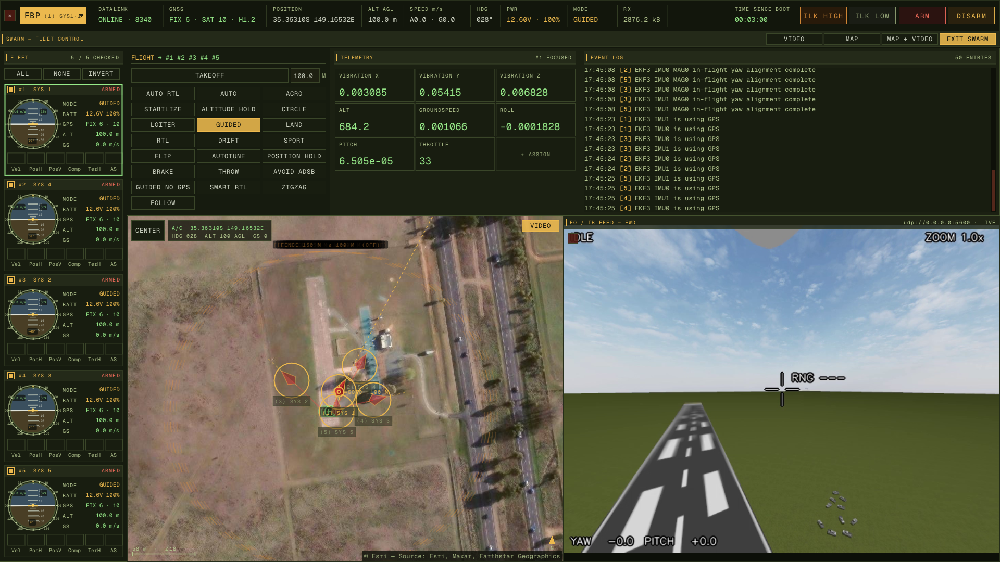</a>
</p>

- **A card per vehicle**, down the left: its number and sysid, armed state,
  attitude, MODE, BATT, GPS, ALT and GS, and the EKF variance bars beneath.
  The column is as wide as the fleet needs — one column for a few aircraft,
  more as the fleet grows, up to half the screen, after which it scrolls
- **Checking and selecting are separate.** The checkbox in a card's corner
  decides whether a command reaches that vehicle; **ALL**, **NONE** and
  **INVERT** above the cards act on the checkboxes only. A click on the card
  body selects the vehicle instead — green frame, and the topbar, telemetry
  tiles and GO HERE follow it — so looking at an aircraft never adds it to a
  batch command. A double click opens the card large, with ASL, airspeed,
  throttle, flight stack and IDs added; a click on it, or **ESC**, puts it back
- **FLIGHT acts on the checked vehicles.** Its header lists who it reaches
  (`FLIGHT → #1 #2 #3`). **TAKEOFF** and the mode grid send to all of them; a
  mode is lit when every checked vehicle is already in it, and a mixed
  ArduPilot/PX4 set gets one grid per stack. Each card shows its own
  vehicle's answer to the last command, so the one aircraft that refused is
  easy to find
- **The topbar's arming buttons act on the checked vehicles too**: **ILK
  HIGH** / **ILK LOW** for motor interlock (PX4 vehicles in the set are skipped
  and logged) and **ARM** / **DISARM**, which name every vehicle they will
  reach and ask before sending
- **Batch commands are retried.** A command sent to more than one vehicle at
  once goes out again to each vehicle that has not answered within a second,
  up to three tries in all; a vehicle still silent after the third is named in
  the event log (`sys7: no ACK for command 176 after 3 tries`). This is the only
  thing the GCS ever resends on its own: a command to a single vehicle goes
  out once
- **Telemetry and event log** across the top: the telemetry tiles of the
  selected vehicle, and the whole fleet's event log
- **Map, and video beside it.** The map fills the space below, with checked
  vehicles ringed. The **VIDEO** toggle at its top-right corner splits that
  space into map and feed, while there is room for both — see
  [Screen Sizes](#screen-sizes)

### Screen Sizes
The layout is worked out from the screen and the font each frame, not from
fixed fractions of the window, so a laptop, a 4K screen and an ultrawide each
get a layout that uses their space rather than a stretched copy of one.

**Sidebars are as wide as their text.** The UI font is monospaced, so a column
is measured in characters: each sidebar has a minimum — its widest row that
cannot shrink, such as a parameter ID beside its value and WRITE — and a
maximum, the width it has on a 1080p screen. Past the maximum they stop
growing, and every extra pixel goes to the centre.

**MAP + VIDEO picks its arrangement from the space left.** While the centre is
no more than about one and a half times as wide as it is tall, the feed sits
above the map and the two get equal areas. Wider than that — an ultrawide, or
a wide screen with a short window — they go side by side and split the centre
in half: map on the left beside the mission tabs, video on the right beside
the plugin rail. The feed is always 16:9, so whatever its half does not fill
is letterbox; the map is never cut down to fit the feed.

| Screen          | MAP + VIDEO                         |
|-----------------|-------------------------------------|
| 1920×1080       | stacked                             |
| 2560×1440, 4K   | stacked, the centre taking the gain |
| 2560×1080       | side by side                        |
| 3440×1440       | side by side                        |
| 3840×1080 32:9  | side by side                        |

**Narrow screens get the fullscreens only.** When there is no room for both
sidebars at their minimum beside a usable centre — below about 1400 px wide,
so 1366×768 laptops and portrait screens — the right sidebar and the plugin
rail go and the mode buttons become **VIDEO FULL**, **MAP FULL** and **SWARM**.
MAP FULL keeps the left sidebar and brings attitude and the event log back as
the overlay in the map's corner; there is no windowed view to exit to, so ESC
does nothing. Widen the window and the view you had comes back.

**The topbar drops readouts rather than cutting them.** When the row does not
fit, whole readouts go in this order: RX, POSITION, HDG, GNSS, SPEED, ALT AGL,
then DATALINK; PWR and MODE stay longest. What is on the map or in a tab goes
first; what you fly on stays.

**SWARM can show the feed too.** A **VIDEO** toggle at the top-right of the
swarm map splits it into map and video by the same rules. It is offered only
while the map keeps a usable size beside it: on a 1080p screen that is up to
two columns of vehicle cards, on wider screens all of them. With more cards
than that the toggle disappears and the map has the space to itself; your
choice is kept for when the column narrows again.

On Wayland, sizes are in the desktop's scaled units, so a 4K screen at 200%
gets the 1080p layout at twice the sharpness. Windows and X11 do not
apply display scaling yet — see [Limitations](#limitations).

### Flight Controls
1. Navigate to the **FLIGHT** tab. Everything on it is disabled until a vehicle
   is heard from, and says `(no link)` beside the header while it is
2. **TAKEOFF** climbs to the altitude in the field beside it — metres above
   home, the same datum GO HERE uses
3. The mode grid is built from the vehicle's own **AVAILABLE_MODES** list where
   it publishes one, since `custom_mode` numbering is per airframe — a Plane's
   mode 4 is not a Copter's. Flight stacks that never answer fall back to the
   ArduCopter table. The current mode is lit, and hovering a button gives the
   full name the vehicle reported. **RTL** is one of these buttons rather than
   a control of its own — it is a flight mode like any other, and two ways to
   reach one mode is one more than an operator should have to think about
4. **EKF STATUS** below it shows variance bars for velocity, horizontal and
   vertical position, compass, terrain and airspeed
5. **SERVO** drives a servo output directly by PWM; **AUX** triggers any
   auxiliary function the connected firmware implements

<p align="center">
  <a href="screens/flight.png"></a>
</p>

### Parameter Workflow
1. Navigate to **PARAMETERS** tab
2. Click **FETCH ALL** to download full parameter set
3. Use search box to filter (e.g., `WPNAV`, `EK2_`)
4. Edit values in-place — each row gets the editor its type calls for: a
   dropdown for an enum, a free number field for an integer or float, and for
   a bitmask its value in hex, which opens to one checkbox per bit (or type
   the hex directly). A number outside its documented range turns amber and
   says so on hover, in the log when written, and in the WRITE ALL
   confirmation, but it is never blocked
5. Click **i** beside a row for everything the firmware documents about it:
   description, units, range, increment, accepted values or bits, whether a
   reboot is needed, and the type the vehicle stores it as. For an enum or a
   bitmask, **MANUAL ENTRY** swaps the row's list or checkboxes
   for a plain number field, for values the reference does not list; hovering
   the field names what the number means. Press it again to switch back
6. Click **WRITE** to commit one change, or **WRITE ALL** to send every edited
   parameter at once (asks for confirmation, and shows the count on the button)
7. Click the **×** beside a changed value to drop that one edit, or **DISCARD**
   next to WRITE ALL to drop every staged change at once

Edits are staged until written: a row whose value differs from the vehicle's
shows an amber **WRITE**, and clears once the vehicle echoes the new value back.
Anything the vehicle misses stays visibly dirty — press again.

Only values *you* moved count as staged. A parameter the vehicle changes on its
own — ArduPilot saves its `STAT_*` counters as it runs, and broadcasts each save
— updates the row in place without ever becoming a pending edit, so WRITE ALL
can never offer to write a stale value back over a newer one.

Under **PARAM FILE**, both **LOAD** and **SAVE** name their file through a
browser rather than a typed path — an in-app one, drawn by the same ImGui pass
as the rest of the panel rather than the desktop's own dialog. Neither reads
nor writes anything until a file has been named, and the browser opens where
the last one left off, so a save after a load lands beside what was loaded.
SAVE asks before overwriting; LOAD does not, having nothing to overwrite.

The documentation comes from each firmware's published parameter reference,
one page per release, merged into a checked-in table. Rerun the script when a
new release comes out:

| Firmware | Releases | Source | Script → table |
|---|---|---|---|
| ArduPilot Copter | every stable release from 4.0.0 | [parameters.html](https://ardupilot.org/copter/docs/parameters.html) and its version picker | `scripts/gen_param_meta_ardupilot.py copter` → `frontend/widgets/param_meta_arducopter.cpp` |
| ArduPilot Plane | every stable release from 4.0.0 | [parameters.html](https://ardupilot.org/plane/docs/parameters.html) and its version picker | `scripts/gen_param_meta_ardupilot.py plane` → `frontend/widgets/param_meta_arduplane.cpp` |
| PX4 | every release from v1.12 (`main` left out) | [parameter_reference](https://docs.px4.io/main/en/advanced_config/parameter_reference) and its version dropdown | `scripts/gen_param_meta_px4.py` → `frontend/widgets/param_meta_px4.cpp` |

The ArduPilot script takes `<copter|plane> <out_cpp> [<cache_dir>]`, the PX4
one `<out_cpp> [<cache_dir>]`; pages already in the cache are not fetched again.

Parameters are renamed and re-documented between releases (`ARMING_CHECK`
became `ARMING_SKIPCHK`, `WPNAV_SPEED` in cm/s became `WP_SPD` in m/s), so once
the vehicle reports its firmware version every row is read against that
release's page, and the tab says which one. PX4 publishes a page per minor
release, so a 1.15.4 vehicle reads v1.15's. A parameter that release's page
leaves out is shown as the nearest release documents it, and **i** says so.
PX4's pages also give each parameter's default, which **i** shows.

ArduPilot's pages name enums and bitmasks but not storage types, so a plain
number is edited as an integer or a float by the type the vehicle reports.
PX4's name the type. A list of values counts as an enum only when every value
is whole and the documented range admits nothing the list leaves out.
Otherwise the values are named points within a range (`ATC_INPUT_TC`'s 0.5
"Very Soft", 0.2 "Soft", … anywhere from 0 to 1; PX4's `GPS_1_PROTOCOL`, whose
range runs past its list), so the field stays free and **i** lists them as
suggested values. A PX4 boolean is a Disabled/Enabled dropdown. ArduPilot's
documentation is per vehicle: Copter's to multirotors and helicopters,
Plane's to fixed-wing and VTOL types (QuadPlanes included); Rover and Sub get
none. PX4's applies to every airframe.

**DISCARD** asks for confirmation because a loaded parameter file can put
hundreds of edits behind it and there is no undo. The per-row **×** does not:
it can only lose one value, and the value it restores is on the vehicle.

<p align="center">
  <a href="screens/params.png"></a>
  &nbsp;
  <a href="screens/param_info.png"></a>
</p>

#### Parameter files

**SAVE** and **LOAD** under the fetch buttons read and write the `.params`
format Mission Planner and QGroundControl use, so files move between all three:

```
# Onboard parameters for Vehicle 1
#
# Stack: ArduPilot
# Vehicle: Quadrotor
# Version: 4.8.0 dev
# Git Revision: 1ea89b0b
#
# Vehicle-Id Component-Id Name Value Type
1	1	ACRO_BAL_PITCH	1.000000000000000000	9
1	1	ACRO_OPTIONS	0	2
```

The last column is `MAV_PARAM_TYPE`; floating types are written at full
precision so a saved value reloads as the same float rather than as an edit.

- **LOAD asks before it stages anything.** It opens a picker listing every
  parameter the file would change — name, the vehicle's value, and the file's —
  each with a checkbox, all ticked to start, plus **SELECT ALL** /
  **DESELECT ALL**. A config file from another airframe carries plenty that
  should not follow it over, so untick what you did not come for and **STAGE**
  the rest.
- **Only differences are offered.** Parameters the file sets to the value the
  vehicle already holds are not changes to review; they are counted in the
  picker's summary line along with parameters the vehicle does not have and
  malformed lines. If nothing differs, the picker does not open at all.
- **Staging is still not writing.** Accepted rows join the same pending edits a
  hand edit makes, so the list shows exactly what changed and **WRITE ALL**
  remains a deliberate second act.
- **SAVE writes what the list shows**, pending edits included — the file is the
  configuration in front of you, not a snapshot of the vehicle. The log says so
  whenever the two differ.

### Mission Planning
1. Navigate to **MISSION** tab in left sidebar
2. Click **FETCH** to download current mission from vehicle
3. Add items from the command grid. A command with a position (WAYPOINT,
   TAKEOFF, LAND, LOITER, ROI, ...) arms the map: its button reads **LOC?**
   until you click the map, and the item is added there. Press it again or
   **Esc** to cancel. A command without one (RTL, SPEED, DELAY, JUMP, ...) is
   added at once. **MORE...** holds the rest of the commands
4. Press **EDIT** (the full-width button above the grid) and drag any waypoint
   on the map to move it; press it again or **Esc** to go back to panning
5. Click an item in the list to expand or collapse it and adjust its
   altitude, parameters and command type. A newly added item opens expanded
   and the others collapse
6. Click **UPLOAD MISSION** to send the mission to the vehicle
7. Click **CLEAR** to empty the editor

New items take the altitude of the last item that has one, or 20 m. Leaving
the MISSION tab cancels a pending **LOC?** and turns **EDIT** off.

### Geofence
The parameter fence needs no editing here: set `FENCE_ENABLE`, `FENCE_TYPE`,
`FENCE_RADIUS` and `FENCE_ALT_MAX` in **PARAMS** (PX4: `GF_ACTION`,
`GF_MAX_HOR_DIST`, `GF_MAX_VER_DIST`) and the ring around home follows as the
vehicle echoes each one back. The **GEOFENCE** view of the MISSION tab
summarises it.

Uploaded zones are edited in that view:

1. Click **FETCH** to download the vehicle's current fence. Fetch before
   editing to keep its existing zones: an upload replaces the whole list
2. **POLYGON**: click the map for each vertex, then click the first vertex,
   press **Enter** or press the button (now **CLOSE**) to finish. **CIRCLE**:
   click the centre, then click again to set the radius. **Esc** cancels. A
   new zone is an inclusion zone (the vehicle must stay inside)
3. Click a zone in the list to switch it to **EXCLUSION** (the vehicle must
   stay out) or back, set a circle's radius, or type vertex coordinates.
   **EDIT** lets you drag polygon vertices and circle centres on the map
4. Click **UPLOAD FENCE**. **CLEAR** followed by **UPLOAD EMPTY FENCE** removes
   the vehicle's fence

On ArduPilot, uploaded zones are only enforced with `FENCE_ENABLE` set and the
Polygon bit (4) in `FENCE_TYPE`; the view warns when either is missing. A
Plane's fence return point (`MAV_CMD_NAV_FENCE_RETURN_POINT`) is kept through
a fetch and upload but not edited.

### The Map
The map draws every vehicle that has a position, not only the one the panels
are following. Each aircraft carries a label — `(2) SYS 1`, the GCS's number
then the sysid it reports — and the selected one keeps full colour and a heading
line run out to the edge of the panel, while the rest are dimmed with a short
stub so three aircraft do not lay three dotted lines across the imagery.

<p align="center">
  <a href="screens/cap3.png"></a>
</p>

Behind each aircraft is its **trail**, recorded off the live stream rather than
off what is on screen: an aircraft that flew while you were watching another one
still has its track when you switch back. Points are thinned to one every 3 m,
so a vehicle standing still does not smudge, and capped at 6000 — about 18 km of
ground track. Each vehicle's **home**, from `HOME_POSITION`, is drawn as a
helipad: an H inside its circle, in green so it reads as neither the aircraft
nor an instruction to it.

**CENTER** — the map follows the selected aircraft until you drag it. The
**CENTER** button in the map's top-left corner, lit while following, puts the
map back on the aircraft and keeps it there. It follows whichever vehicle is
selected, so after switching vehicles it centres on the new one.

**GO HERE** — right-click anywhere on the map for a guided position target. The
menu shows the coordinates under the cursor (click them to copy, as signed
decimal degrees) and an altitude, which starts at the
height the vehicle is already holding, and **GO** sends it as
`SET_POSITION_TARGET_GLOBAL_INT`. It only sends while the vehicle is in GUIDED,
which is the only mode that acts on one; out of GUIDED the button is disabled
and says why, rather than sending into silence. The target stays drawn as a
ringed crosshair joined to the aircraft by a line until **CLEAR TARGET**. The
same menu carries **CLEAR TRACK** for the trail.

**MAP FULL** — with the map alone in the centre view, the map button relabels
itself. Press it and the map takes the right sidebar's width and the plugin
rail's column; the left sidebar stays, because the tabs are how a mission is
planned and the map is what it is planned on. Attitude and the event log come
back as a semi-transparent block in the map's top-right corner, small enough to
read the map past. Click either half and it grows to the size it had in the
sidebar, text and all, until you click somewhere else; it always comes back
small the next time the map goes fullscreen. **ESC** or **EXIT FULL** restores.

<p align="center">
  <a href="screens/cap2.png"></a>
</p>

### Radio Calibration
1. Fetch parameters first — **PARAMS → FETCH ALL**. Every WRITE on this tab is
   disabled until the vehicle's current values are known, and a red banner says so
2. Navigate to the **RADIO** tab and check the monitor: one row per channel the
   receiver is sending, so a radio that is off or unbound is obvious before you start
3. Click **START CALIBRATION**
4. **1 / 3 CENTRE** — centre the sticks, throttle fully down, then **CAPTURE**
5. **2 / 3 SWEEP** — move every stick and switch to both stops. The amber band on
   each bar is the travel recorded so far, and the progress reads against the
   channels actually carrying a signal, not the eighteen the protocol allows.
   **FINISH** when the count stops rising
6. **3 / 3 REVIEW** — check each channel's endpoints and trim, and tick **REV**
   where a stick runs the wrong way. A sweep cannot tell direction, so reversal
   is the one value you have to set; it is seeded from the vehicle so an
   already-correct radio is not un-reversed
7. **COMMIT** writes the lot after a confirmation naming the parameter count.
   **DISCARD** leaves the vehicle untouched

The calibration keeps recording while you look at another tab, or at another
aircraft — it is the vehicle and the radio doing the work, not the panel.

Below the calibration: **BINDING** binds each axis to a channel (press
**DETECT**, move that stick), sets ArduPilot's six flight-mode slots from the
mode list the vehicle published, and binds an aux function to a channel. Each
row writes on its own.

<p align="center">
  <a href="screens/radio.png"></a>
</p>

### Sensor Calibration
1. Fetch parameters first, as above — the device lists are read from them
2. Navigate to the **SENSORS** tab. Each section lists what the vehicle actually
   has: chip name, bus and address, and whether a compass is external and in use
3. **Disarm before calibrating.** Every button here is disabled while armed
4. **Accelerometer** — press **CALIBRATE ACCELEROMETER**, then place the airframe
   as the vehicle asks (level, on each side, nose down, nose up, on its back) and press
   the button for each position. The vehicle drives the sequence; the panel
   reports when the airframe is in place
5. **Gyroscope** — press **CALIBRATE GYROSCOPE** and leave the vehicle still.
   It answers with a single ACK, which is the result
6. **Magnetometer** — press **CALIBRATE MAGNETOMETER** and rotate the vehicle
   slowly through every orientation, keeping clear of metal, magnets and wiring.
   The sphere fills in as directions are covered: turn the airframe so the dim
   patches come round. On ArduPilot the run ends with a per-compass verdict and
   a worst-fit figure in milligauss; press **ACCEPT CALIBRATION** if the vehicle
   is holding the offsets rather than storing them
7. Reboot when it is done — new offsets take effect at boot, and there is a
   **REBOOT VEHICLE** button on the panel

Only one calibration runs at a time *per vehicle*: starting a second would
silently withdraw the first, so each section greys out the others while it is
busy. A run survives a tab switch and a vehicle switch — it belongs to the
aircraft it was started on and keeps advancing while you look elsewhere — and is
abandoned with a log line if the link drops.

<p align="center">
  <a href="screens/sensor_calibration.png"></a>
</p>

### MAVLink Inspector
1. Navigate to **MAVLINK** tab
2. View message ID, name, and receive rate in scrollable table
3. Click a message row to decode all fields in the detail panel below
4. Use the **REQUEST** panel to configure message intervals (MAVLink 2 only):
   - Enter message ID (e.g., `33` for GLOBAL_POSITION_INT)
   - Set rate in Hz (e.g., `10`)
   - Click **SEND** to apply

<p align="center">
  <a href="screens/mavlink.png"></a>
</p>

### Video Streaming
1. Navigate to the **VIDEO** area
2. Enter stream URL:
   - RTSP: `rtsp://192.168.1.100:8554/stream`
   - UDP: `udp://0.0.0.0:5600`
3. Click **START STREAM**
4. Video will render in center view
5. With the feed alone in the centre view the button relabels itself
   **VIDEO FULL** — press it and the feed goes fullscreen: both sidebars give
   way and the picture takes the whole window below the topbar, so link state,
   arming and the annunciators are never hidden. The plugin rail stays,
   floating over the feed's right edge, since there are no sidebars left to
   take its width from. The button then reads **EXIT FULL**; that, **ESC**, or
   either other mode button brings the panels back.

<table>
  <tr>
    <td align="center" width="50%">
      <a href="screens/cap4.png"></a><br>
      <sub><b>VIDEO</b></sub>
    </td>
    <td align="center" width="50%">
      <a href="screens/cap1.png"></a><br>
      <sub><b>VIDEO FULL</b></sub>
    </td>
  </tr>
</table>

### Audio Cues
1. Navigate to **SETTINGS** tab, **AUDIO** section
2. **Tones** mutes everything; the volume slider is linear, and **TEST** plays
   the success tone
3. Both settings save immediately and survive a restart

What plays, and when:

Square waves at 125 ms a note, written in the idiom of GRUB's `GRUB_INIT_TUNE`
(tempo 480, so one beat is 125 ms):

| Cue | Sound | As a GRUB tune | Fires on |
|---|---|---|---|
| Success | rising fifth | `480 440 1 660 1` | a hand-issued command the vehicle accepted (arm/disarm, takeoff, RTL, mode change, aux function), mission upload accepted, link established |
| Failure | three notes falling | `480 660 1 440 1 330 1` | the same commands rejected, mission upload failed, link error or timeout |
| Armed | one note, every 5th HEARTBEAT | `480 440 1` | the whole time the vehicle is armed — starting on the arming heartbeat itself |
| Progress | short blip, accelerating | `480 880 0.25` | under a progress bar — parameter fetch, mission download |

Telemetry-rate and capability requests are ACKed too, but deliberately make no
sound: a burst of beeps at every connect trains you to ignore the cue.

The progress tick is the parking-sensor idiom: the gap between blips shrinks
from 700 ms at 0% to 80 ms at 100%, so **how far along** and **still moving**
are both in the ear and a long parameter fetch can be started and then watched
out of the window. The gap shrinks geometrically rather than linearly — each
10% of the bar speeds the ticking up by the same proportion, because tempo is
heard as a ratio, and a straight line in milliseconds sounds like nothing
happens until the very end. The tempo follows the fraction and not its rate of
change, so a transfer that stalls at 60% keeps ticking steadily at its 60%
tempo: an unchanging tempo is audibly a stall, where silence would be
indistinguishable from a transfer that quietly finished. Transfers tick on
independent channels, so a mission download during a parameter fetch keeps its
own tempo instead of the two beating against each other.

The armed beep counts HEARTBEATs rather than seconds — every fifth one, so
about every five seconds at the 1 Hz ArduPilot sends them. Counting the
vehicle's pulse rather than a clock carries what a clock cannot: **beeping that
stops while the aircraft is still armed means the link went, not that the
vehicle disarmed.**

### Themes
1. Navigate to **SETTINGS** tab
2. Select **Tactical** (default), **Retro Amber** or **Matrix**
3. Create custom themes by editing color values
4. Themes persist across sessions via `settings.json`

### AI Agents (MCP)

The GCS has a built-in [Model Context Protocol](https://modelcontextprotocol.io)
server, so any agent or LLM host that speaks MCP can connect to it: Claude Code,
opencode, Claude Desktop, Cursor, or your own scripts. That includes small models
running locally. The agent can read every vehicle's telemetry, parameters,
mission and messages. If you turn actions on, it can also command vehicles,
within limits you set and normally with you approving each command on screen.

Nothing is reachable until you switch it on, and actions stay off until you
switch those on separately.

#### Turning it on

1. Open the **SETTINGS** tab and scroll to **ASSISTANT (MCP)**
2. Tick **MCP server**. The line beside it should read
   `listening on 127.0.0.1:8737`
3. A token is generated the first time. **COPY TOKEN** copies it, and
   **NEW TOKEN** replaces it, which disconnects every client set up with the
   old one

The server only listens on this computer (`127.0.0.1`), and every request has
to carry the token. Requests from web pages on other sites are refused, so a
website open in your browser cannot reach it either.

#### Connecting an agent

Most hosts start an MCP server as a program and talk to it over stdin and
stdout. That program is `freebodyproblem-mcp`, the adapter installed beside the
GCS. It forwards everything to the running GCS, and finds the port and token by
itself in the GCS's `settings.json`.

**COPY ADAPTER PATH**, in the same settings section, copies its full path:

| Installed from | Adapter |
|---|---|
| Linux `.deb` | `/usr/bin/freebodyproblem-mcp` (on `PATH`) |
| Windows installer | `C:\Program Files\freebodyproblem\bin\freebodyproblem-mcp.exe` |
| Source build | `build/freebodyproblem-mcp` |

Give that path to your host as the server's command. For example:

**Claude Code**

```sh
claude mcp add freebodyproblem -- /usr/bin/freebodyproblem-mcp
```

**opencode** (`~/.config/opencode/opencode.json`)

```json
{
  "mcp": {
    "freebodyproblem": {
      "type": "local",
      "command": ["/usr/bin/freebodyproblem-mcp"],
      "enabled": true,
      "codemode": false
    }
  }
}
```

`"codemode": false` matters for small models. With Code Mode on, opencode
makes the model write JavaScript to call tools, and small models get that
wrong. It has to be the boolean `false`, not a string. After changing the
config, restart opencode's background service.

**Other hosts** (Claude Desktop, Cursor and most others use this shape)

```json
{
  "mcpServers": {
    "freebodyproblem": { "command": "/usr/bin/freebodyproblem-mcp" }
  }
}
```

**Over HTTP directly**: hosts that support MCP's Streamable HTTP can skip the
adapter and use `http://127.0.0.1:8737/mcp` with the header
`Authorization: Bearer <token>`.

The adapter also takes `--port` and `--token`, or the environment variables
`FBP_MCP_PORT` and `FBP_MCP_TOKEN`, for a GCS running with a different settings
file. If the GCS is not running, the agent gets a clear "not reachable" error
rather than a hang.

#### What an agent can do

**Reading** is always allowed and changes nothing:

| Tool | What it gives |
|---|---|
| `get_guidelines` | How the GCS works, your rules for agents, and what is allowed right now |
| `list_vehicles` | Every vehicle: its number, type, armed state, mode, link and claim |
| `get_telemetry` | Position, home, attitude, speeds, GPS, battery, estimator health, modes |
| `get_params` | Parameters by name or prefix, from the table the GCS has fetched |
| `get_mission` | The mission and geofence, optionally downloaded fresh from the vehicle |
| `get_messages` | The vehicle's recent status texts: prearm failures, warnings |
| `list_plugins` | The buttons on the plugin rail |

**Actions** send commands, and only exist once you tick **Allow actions**:

| Tool | What it does |
|---|---|
| `arm` / `disarm` | Start or stop the motors |
| `takeoff` | Climb to a height above home |
| `goto` | Fly to a point and hold — by latitude/longitude, or as metres north/east/up from where the vehicle is now |
| `set_mode` | Any mode the vehicle accepts |
| `start_mission` / `pause_mission` | Fly the stored mission, or stop and hold where it is |
| `upload_mission` | Replace the stored mission with a list of steps |
| `return_to_launch` | Fly home |
| `set_param` | Change one parameter |
| `run_plugin` | Press a plugin button for a vehicle |

Vehicles are named by the GCS's own number, the `(2)` on the map and callsign
chip, not by MAVLink system ID. Altitudes are metres above home. Every action
reports whether the vehicle accepted it, and points the agent at telemetry to
check what actually happened.

The `goto` offset form exists for agents that think in "100 m north": the GCS
does the coordinate arithmetic rather than the model, which small models
frequently get wrong.

#### Approving actions

Under **Allow actions**, each action has a **Run without asking** box.

- **Unticked** (the default for every action): when an agent asks, an
  **ASSISTANT REQUEST** dialog opens with what it wants to do, to which
  vehicle, and the reason it gave. **ALLOW** sends it; **REFUSE** or
  **ESC** turns it down. ALLOW has no keyboard shortcut, on purpose: the
  dialog opens on its own, and an Enter meant for something you were typing
  must not approve a command. If you do not answer within 45 seconds, the
  request is refused.
- **Ticked**: the action runs as soon as the agent asks. It is still
  written to the event log.

**ASK FOR ALL** and **ALLOW ALL** set every box at once. Changes take effect
immediately, even for an agent that is already connected. Unticking **Allow
actions** removes the action tools from it straight away.

#### Your rules for agents

**Instructions for agents** is a free-text box sent to every agent when it
connects, after the GCS's own guidance, and again whenever an agent calls
`get_guidelines`. Use it for site rules: a ceiling, an area to keep out of,
which vehicles an agent may touch. Agents are told to follow it, but it is
guidance to the model, not something the GCS enforces. Use the approval
dialog for anything you need to be certain about.

#### Several agents at once

When more than one agent shares the fleet, an agent can **claim** a vehicle
with `claim_vehicle`. While the claim holds, other agents' actions on that
vehicle are refused. A claim ends when the agent releases it or after 15
minutes without use. Claims only ever stop other agents, never you. The
settings section lists the current claims, and **RELEASE ALL CLAIMS** clears
them.

#### Separation warnings

Before a `takeoff` or `goto`, the GCS walks the path the vehicle will fly and
checks it against every other armed vehicle and every point another agent has
sent a vehicle to. If they come within 10 m horizontally and 5 m vertically, the
approval dialog shows a red **SEPARATION** warning, and the agent is told. The
check is advisory: it does not block the command, you decide.

#### In the event log

Everything agents do appears in the event log, tagged **MCP** in blue: an agent
connecting, every action with its outcome, and refusals. Reads are logged too,
but grouped, at most one line per tool and vehicle every 30 seconds. An agent
polling telemetry cannot push the vehicles' own messages out of the log.

## Architecture

The process runs one thread per link and one thread per vehicle. A link reads
bytes and frames them; framing has to happen there because a message's sysid is
not knowable until it is framed. Everything after that — the message dispatch,
the parameter table, the mission state and the protocol timers — belongs to one
vehicle and runs on that vehicle's own thread. Sending goes the other way: a
vehicle queues frames in its own sender, and the link, which owns the socket or
the serial handle, drains them.

```
  socket / serial ──▶ link thread          one per connection
                       read, frame, demux on sysid
                              │
                              ▼  inbox
                     vehicle thread        one per vehicle
                       dispatch, protocol timers, snapshot
                              │
                              ▼  snapshot
                        UI thread          draws the selected vehicle
```

### Backend (`backend/`)
- **connection.cpp**: Serial port enumeration (Linux/Windows)
- **link.cpp**: One transport — UDP socket, TCP connection or serial port — and the platform detail behind opening, reading and writing it
- **fleet.cpp**: Every link and vehicle, the link read threads, and the sysid demultiplexing that decides which vehicle a message belongs to
- **vehicle.cpp**: One vehicle and the thread that talks to it — stream rates, the mode list, clock sync, the parameter fetch and its retransmits, and the snapshot the UI reads
- **mavlink_framer.hpp**: Byte stream to whole messages, with the reassembly buffer held per link rather than in the library's per-channel globals, so links can frame concurrently
- **mavlink_parser.cpp**: MAVLink message decoder with per-ID stats tracking; one per vehicle, and it accepts only that vehicle's system
- **mavlink_sender.cpp**: Command queue with ACK tracking and retransmit logic; one per vehicle, each keeping its own outgoing sequence counter, so there is no cap on how many vehicles the fleet holds
- **mcp_server.cpp**: the built-in MCP server — Streamable HTTP on loopback, bearer token, the read and action tools, the approval queue the UI thread drains, vehicle claims between agents, and the separation check on takeoff and goto paths
- **geofence.cpp**: uploaded geofence zones — polygons and circles, inclusion and exclusion — to and from the fence list's mission items
- **firmware_profile.cpp**: what differs between flight stacks in one place — which message carries estimator health (ArduPilot's `EKF_STATUS_REPORT` vs the portable `ESTIMATOR_STATUS`), each stack's built-in mode table for vehicles that publish no `AVAILABLE_MODES`, and how a mode number is written on the wire. PX4 splits main and sub mode across two command parameters where ArduPilot puts one flat number in the first; sending ArduPilot's shape at PX4 is rejected
- **rc_calibration.cpp** / **rc_binding.cpp**: RC endpoint measurement and the stick/mode/aux parameter tables, per stack
- **accel_calibration.cpp** / **gyro_calibration.cpp** / **mag_calibration.cpp**: the GCS half of each calibration — link-free state machines fed messages and a clock
- **sensor_inventory.cpp**: compass/accel/gyro devices decoded out of the parameter table (device-ID packing, chip names)
- **geodesic_grid.cpp**: ArduPilot's 80-section coverage grid, for drawing what a compass calibration has and has not seen

### Frontend (`frontend/`)
- **main.cpp**: GLFW/OpenGL event loop, the app log, and the per-frame snapshot of whichever vehicle is selected
- **settings.cpp**: JSON-based persistent configuration (tile server, themes, window state)
- **param_file.cpp**: `.params` reader/writer (Mission Planner / QGroundControl format)
- **audio.cpp**: synthesised cue tones and accelerating progress ticks — lock-free voice pool mixed on the miniaudio callback
- **widgets/**: Modular UI components (topbar, sidebars, map, video, telemetry panels)
  - **layout_rules.hpp**: The screen layout as plain arithmetic, free of ImGui — sidebar widths in glyphs, the narrow cutoff, and the stacked or side-by-side split of MAP + VIDEO and of the SWARM map. **layout.hpp** feeds it the live window and the measured width of a glyph
  - **goto_target.hpp** / **mission_pick.hpp**: The two-way state the map is driven through — a right-clicked position target and a waypoint being picked. The map never holds a sender; it reports what the operator asked for and the panel that owns the vehicle sends it
  - **vehicle_ui_state.hpp**: Panel state that belongs to a vehicle rather than a panel — a calibration in progress, staged parameter edits, the mission being planned — keyed by vehicle instead of held in a file-scope static, and dropped when that vehicle goes
  - **sidebar_left/**: Tab-based left panel (connection, flight, params, themes, mission, MAVLink, radio, sensors)
  - **map_view.cpp**: Multi-threaded tile fetcher with OpenGL texture upload, and everything drawn over it — the fleet's aircraft symbols and labels, per-vehicle trails, home pads, the mission overlay and the GO HERE menu
  - **video_player.cpp**: GStreamer pipeline wrapper with RGB frame extraction
  - **plugin_rail.cpp**: Button column driving the user plugins in `plugins/`
  - **mcp_approval.cpp**: The ASSISTANT REQUEST dialog an agent's action waits on
  - **mavlink_display_generated.cpp**: Auto-generated message field decoders (from MAVLink XML)

### Plugins (`plugins/`)
- **plugin_api.hpp**: What a plugin sees and how it registers — buttons, startup hooks, video-gesture handlers
- **plugin_registry.cpp**: Registration lists, startup pass, and dispatch
- **user_plugins.cpp**: Example slots, yours to edit — see [plugins/README.md](plugins/README.md)

### Code Generation
- **scripts/gen_mavlink_display.py**: Parses MAVLink XML definitions to generate C++ field decoders for all message types

### Libraries
- **Dear ImGui** (third_party/imgui): Immediate-mode GUI
- **ImGuiFileDialog** (third_party/ImGuiFileDialog): In-app file browser for the parameter-file path — renders through the same draw list as everything else, so it needs no native GTK/Win32 dialog and inherits the active theme
- **MAVLink** (third_party/mavlink): Auto-generated C headers (ardupilotmega dialect)
- **stb_image / stb_image_write** (FetchContent): PNG/JPG decoding for map tiles, PNG encoding for video snapshots
- **miniaudio** (FetchContent): header-only audio playback for the cue tones
- **cpp-httplib** (FetchContent): HTTPS client for tile server requests, the MCP server, and the adapter's loopback client
- **nlohmann/json** (FetchContent): JSON parsing for settings and firmware manifests

## Project Structure
```
freebodyproblem/
├── backend/              # Links, vehicles, MAVLink parsing, command queue
├── frontend/             # ImGui UI, widgets, rendering
│   └── widgets/          # Reusable UI components
│       └── sidebar_left/ # Per-tab left sidebar modules
├── plugins/              # User C++ functions bound to the button rail
├── adapter/              # freebodyproblem-mcp: stdio bridge for MCP hosts
├── scripts/              # Python code generators
├── third_party/          # Git submodules (imgui, mavlink)
└── CMakeLists.txt        # Build configuration
```

## Configuration

Settings are auto-saved to a per-user location, not the working directory:

| Platform | Path                                                                                           |
|----------|------------------------------------------------------------------------------------------------|
| Linux    | `$XDG_CONFIG_HOME/freebodyproblem/settings.json`, or `~/.config/freebodyproblem/settings.json` |
| Windows  | `%APPDATA%\freebodyproblem\settings.json`                                                      |

If neither environment variable is set, it falls back to
`./freebodyproblem_settings.json` in the working directory.

Map tiles are cached separately, under
`$XDG_CACHE_HOME`/`~/.cache/freebodyproblem/tiles` on Linux and
`%LOCALAPPDATA%\freebodyproblem\tiles` on Windows. Deleting that directory is
safe — tiles are refetched on demand.

Settings contents:
- **Active theme**: Selected color scheme
- **Custom themes**: User-defined color palettes
- **Tile server**: URL template and attribution string
- **Video URL**: Last used stream source
- **MCP server**: `mcp_enabled`, `mcp_port` (default 8737), `mcp_token`, `mcp_actions_enabled`, `mcp_auto_allow` (action name → runs without asking) and `mcp_instructions` — all set from the SETTINGS tab's **ASSISTANT (MCP)** section, and read by the `freebodyproblem-mcp` adapter for the port and token

Example `settings.json`:
```json
{
  "active_theme": "Tactical",
  "tile_url": "https://tile.openstreetmap.org/{z}/{x}/{y}.png",
  "tile_attribution": "© OpenStreetMap contributors",
  "video_url": "udp://0.0.0.0:5600",
  "themes": {
    "Custom": {
      "bg": [0.05, 0.05, 0.08],
      "accent": [0.2, 0.8, 0.9],
      ...
    }
  }
}
```

## Performance Notes

- **Parallel per-vehicle work**: framing is cheap and stays on the link thread; the message dispatch, parameter table, mission state and protocol timers run per vehicle and overlap, so a slow conversation with one aircraft does not hold up another
- **One message copy at the hand-off**: a framed message is copied once into the owning vehicle's inbox. The inbox is bounded, and a vehicle that falls far enough behind to drop from it says so in the log rather than losing telemetry silently
- **Rate-capped snapshots**: each vehicle publishes its state at ~20 Hz rather than on every datagram, and the UI copies only the vehicle on screen
- **Threaded tile fetching**: Map tiles load asynchronously without blocking the render loop
- **Exponential moving average rates**: Message rate display decays gracefully when telemetry stops
- **Parameter retransmit logic**: Automatically re-requests dropped PARAM_VALUE packets after 2s stall

## Limitations

- **No firmware upload**: Use ArduPilot's `uploader.py` or Mission Planner for bootloader operations
- **No log download**: Access DataFlash logs via MAVLink file transfer in other tools
- **OS support**: Linux and Windows are built and packaged by CI. macOS is not currently built or tested.
- **No telemetry replay**: Live connections only; no `.tlog` or `.bin` file playback
- **No rally points**: the vehicle's rally list (`MAV_MISSION_TYPE_RALLY`) is neither downloaded nor edited
- **One vehicle in the tabs at a time**: the map draws the whole fleet and SWARM gives every vehicle a summary card, but the tabs — parameters, mission, radio, sensors, the inspector — and the telemetry tiles follow the selected vehicle only
- **One vehicle per link per sysid**: an aircraft reachable over two links at once appears as two entries rather than being recognised as one. Merging them wants a real identity to key on (the board UID) and is not done yet
- **Display scaling on Windows and X11**: the UI is drawn in physical pixels there, so at 150% or 200% desktop scaling it comes out smaller than intended. Wayland hands the app scaled sizes and is not affected
- **Plugin rail on short screens**: below about 900 px of height the rail's ten buttons do not fit and the rail scrolls

## Future Plans

- Implementations of "Console" and "ESC" tabs, for the MAVLink console and for ESC configuration with motor test.
- Multi-vehicle UI: more of each aircraft's telemetry on the SWARM cards, so it can be watched without switching between them
- PX4: mission, parameters, RC configuration and sensor calibration (telemetry and modes are done)
- macOS Support
- Video AI features

## Contributing

This is a personal project built for speed and clarity over feature completeness (only the features needed **during** the flight should be implemented). PRs welcome for:
- Bug fixes
- Performance improvements
- Additional MAVLink message handlers
- macOS support
- Telemetry graph overlays
- Other features which are essential during a flight

Please keep contributions focused on the core philosophy: fast, direct, minimal abstraction.
